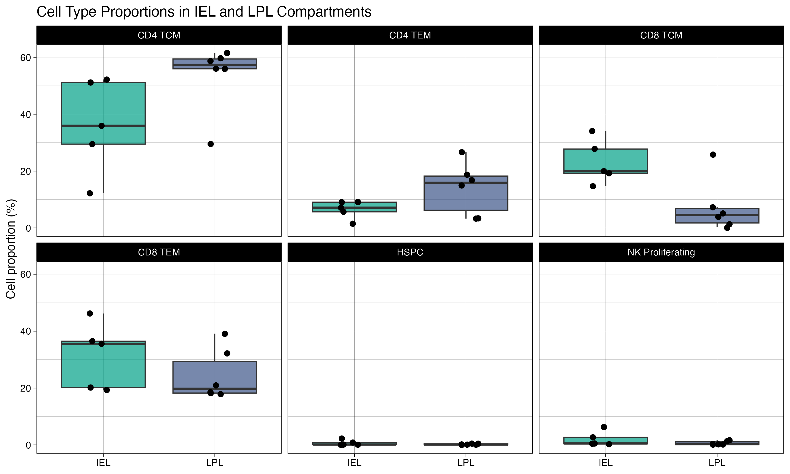
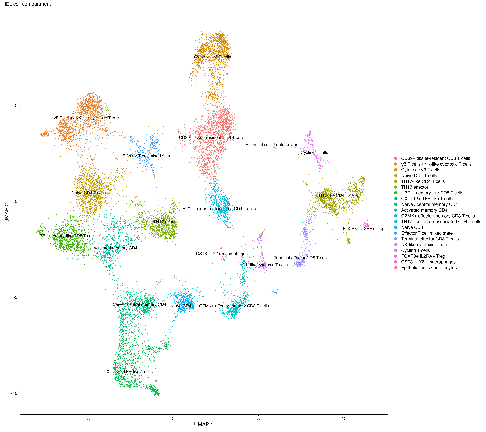
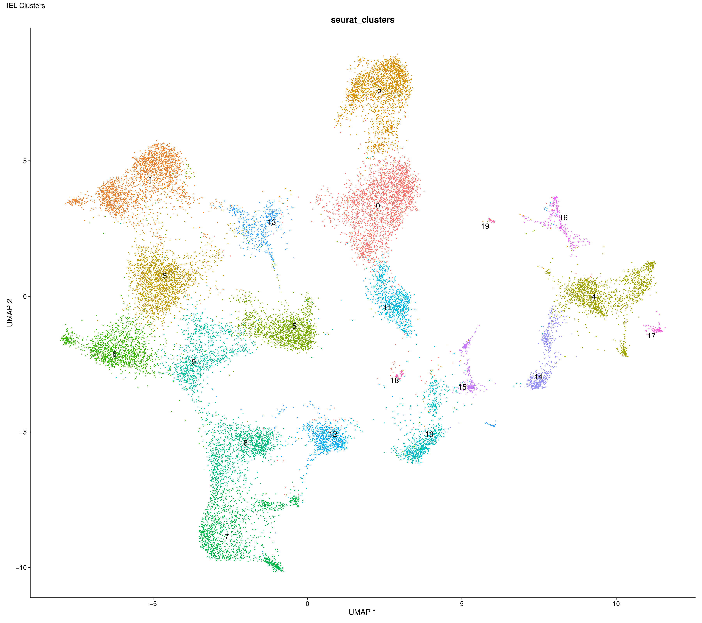
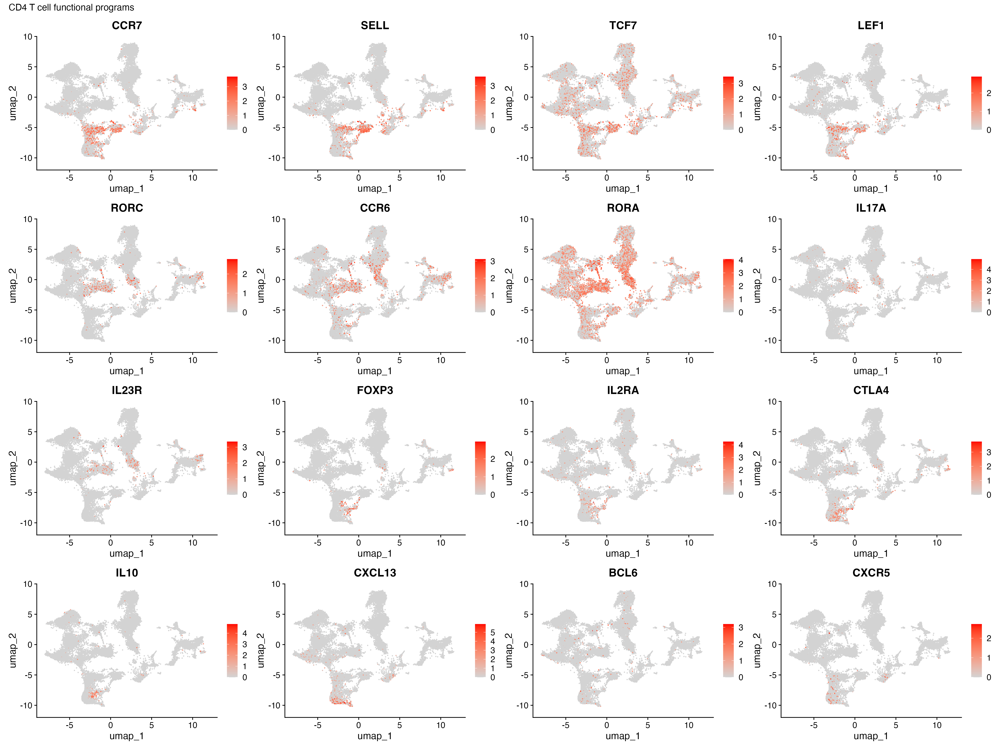
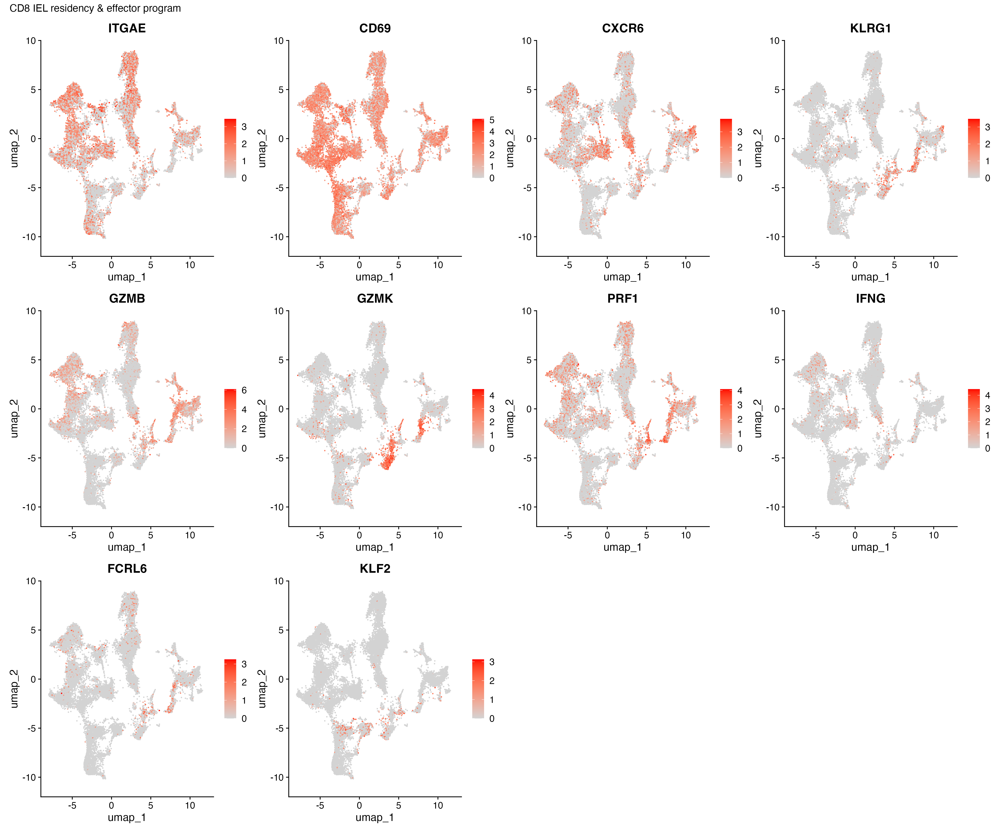
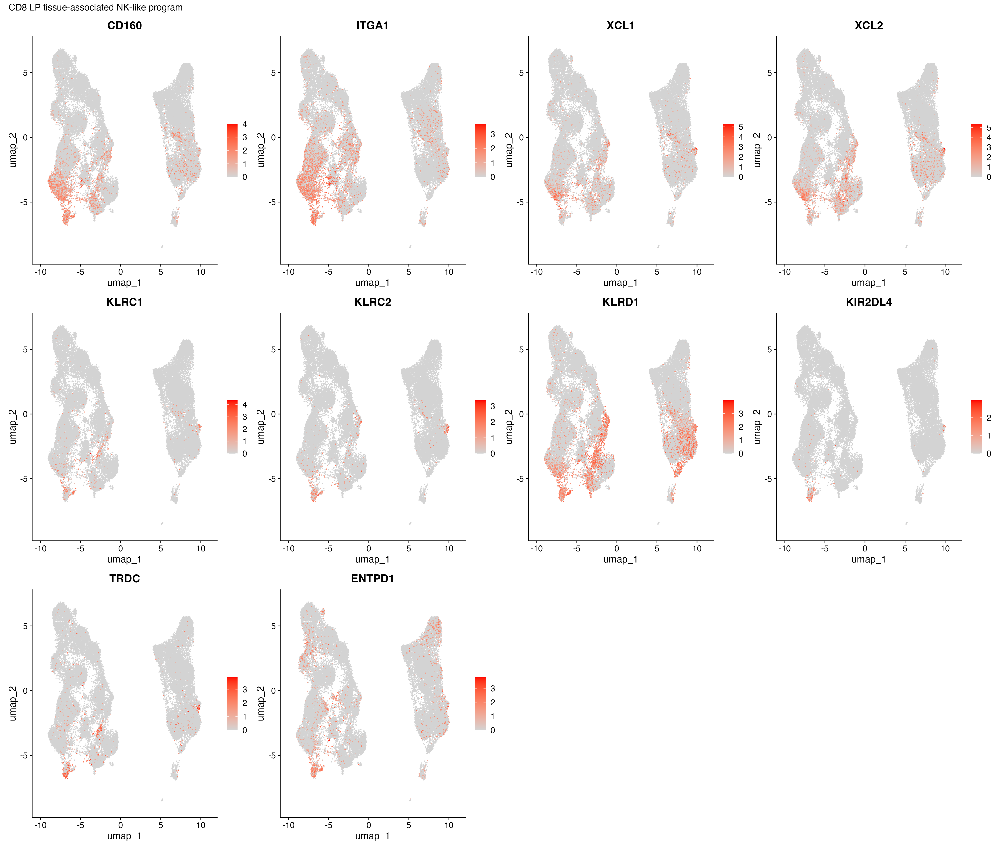

Single-Cell RNA-seq Subsetting Analysis of Intestinal IEL and LPL
Compartments: Transcriptomic Refinement and Cell-Type Resolution
================
Bioinformatics Analysis Service
2026-06-28

# 1. Executive Summary

This report describes the compartment-specific subsetting analysis
performed on the integrated single-cell RNA-seq atlas of the human
intestinal immune system.

Following the global transcriptomic profiling and consensus cell-type
annotation, the dataset was stratified into two major functional immune
compartments:

Intraepithelial lymphocytes (IEL) Lamina propria lymphocytes (LPL)

The objective of this analysis was to resolve compartment-specific
transcriptional programs, refine cellular heterogeneity within each
immune niche, and enable downstream differential and functional
interpretation at increased biological resolution.

The analytical workflow included:

- extraction of IEL and LPL subsets from the globally integrated Seurat
  object
- re-evaluation of quality and distribution of cells per compartment
- compartment-specific normalization and dimensionality reduction
- visualization of transcriptional structure within each compartment
- reassessment of cluster structure in compartmental space
- validation of compartment identity using canonical markers
- preparation of refined objects for downstream differential and
  enrichment analyses

This subsetting step represents the transition from a system-level atlas
to a niche-resolved immune landscape.

------------------------------------------------------------------------

# 2. Biological Rationale for Subsetting

The intestinal immune system is organized into spatially and
functionally distinct compartments, each characterized by specific
lymphocyte populations and transcriptional programs.

The separation into IEL and LPL compartments is biologically motivated
by:

**IEL compartment**  
- enrichment for tissue-resident cytotoxic T cells  
- presence of γδ T cells and unconventional T cell subsets  
- strong epithelial interaction signatures

**LPL compartment**  
- enrichment for helper T cells, T follicular-like populations, and
regulatory T cells  
- higher immunomodulatory and cytokine-driven transcriptional programs  
- stronger antigen presentation and adaptive immune signaling

This separation enables the resolution of transcriptional heterogeneity
that is masked in the global integrated analysis.

------------------------------------------------------------------------

# 3. Data Source and Input Object

The subsetting analysis was performed on the globally integrated Seurat
object obtained from the full intestinal atlas.

This object contains:  
- Harmony-integrated latent space  
- Consensus cell-type annotations  
- Global UMAP embedding  
- Graph-based cluster assignments  
- Compartment annotation (IEL / LPL)  

------------------------------------------------------------------------

# 4. Compartment Stratification

Cells were stratified into two major immune compartments based on
annotation-derived labels:

- Intraepithelial lymphocytes (IEL)
- Lamina propria lymphocytes (LPL)

This stratification was followed by compartment-specific reclustering to
resolve internal transcriptional heterogeneity.

## 4.1 Cell distribution across compartments

------------------------------------------------------------------------

# 5. Compartment-Specific Reclustering Strategy

Following extraction of IEL and LPL subsets, each compartment was
independently reanalyzed to resolve internal transcriptional
heterogeneity.

This step involved:  
- reclustering within each compartment  
- evaluation of transcriptional substructure  
- mapping of clusters to biologically interpretable cell types

This approach allows resolution of fine-grained immune states that are
masked in global clustering.

------------------------------------------------------------------------

# 6. IEL Compartment Analysis and Reclustering

## 6.1 IEL transcriptional landscape

The IEL compartment reveals a highly structured and transcriptionally
heterogeneous landscape characterized by tissue-resident and cytotoxic
programs, with additional contributions from γδ T cell, TH17-like, and
regulatory T cell states.

## 6.2 IEL clustering and cell-type consolidation

Reclustering of IEL cells identified:

- 20 transcriptionally distinct clusters

These clusters were consolidated into:

- 20 biologically annotated cell types

This near 1:1 mapping indicates a high-resolution transcriptional
fragmentation of the IEL compartment, reflecting strong cellular
plasticity within the epithelial immune niche.

**Clusters IEL Compartment**

## 6.3 Key marker expression in IEL

Canonical markers were used to validate IEL identity and substructure,
including:

- Cytotoxic signature genes (e.g. GZMB, PRF1, NKG7)
- Tissue residency markers (e.g. CD69, ITGAE)
- γδ T cell markers (e.g. TRDC, TRGC1/2)
- TH17-like T cell markers (e.g. RORA, IL17A)
- TFH-like markers (e.g. CXCL13, PDCD1, BCL6)
- Regulatory T cell markers (e.g. FOXP3, IL2RA)

**CD4 Markers**

**CD8 Markers**

------------------------------------------------------------------------

# 7. LPL Compartment Analysis and Reclustering

## 7.1 LPL transcriptional landscape

The LPL compartment shows higher transcriptional diversity and
enrichment for adaptive immune regulatory and effector programs,
including T helper, T follicular-like, regulatory T cell, and activated
memory states.

## 7.2 LPL clustering and cell-type consolidation

Reclustering of LPL cells identified:

- 21 transcriptionally distinct clusters

These clusters were consolidated into:

- 17 biologically meaningful cell types

This reduction reflects partial redundancy among transcriptional
clusters and convergence of activated/memory immune states into shared
functional programs.

**Clusters LPL Compartment**

## 7.3 Key marker expression in LPL

LPL clusters were validated using canonical adaptive immune markers,
capturing major transcriptional axes including:

- Helper T cell programs (IL7R, CCR7)
- T follicular-like signatures (CXCL13, PDCD1, BCL6)
- Regulatory T cell markers (FOXP3, CTLA4)
- TH17-like inflammatory signatures (IL17A, RORA)
- Cytotoxic and innate-like T cell programs (e.g. GZMB, NKG7)

**CD4 Markers**

**CD8 Markers**

*CD8 Effector Cells*

*CD8 NK-like Cells*

------------------------------------------------------------------------

# 8 Compartment-Specific Biological Interpretation

The compartmental decomposition of the global atlas reveals two distinct
organizational principles of intestinal immunity:

## IEL compartment

IEL cells exhibit high-resolution transcriptional fragmentation with
near 1:1 mapping between clusters and cell types.

This reflects:  
- strong epithelial interaction dependency  
- coexistence of cytotoxic, γδ, and innate-like programs  
- high cellular plasticity within the epithelial niche

## LPL compartment

LPL cells show partial redundancy among transcriptional clusters, which
were consolidated into fewer biologically meaningful cell types.

This reflects:  
- convergence of CD4/CD8 memory and activated states  
- presence of regulatory and TFH-like immune programs  
- modular immune organization with shared transcriptional axes

------------------------------------------------------------------------

# 9. Downstream Analytical Utility

The resulting compartment-specific objects support:

1.  differential gene expression analysis within IEL and LPL
2.  disease vs control comparisons per compartment
3.  pathway enrichment and functional profiling
4.  identification of compartment-specific disease signatures
5.  trajectory or state-transition analysis within niches

------------------------------------------------------------------------

# 10. Reproducibility

All analyses were performed within the same standardized computational
framework used for the global analysis.

Environment:

- R 4.6.0
- Seurat 5.5.0
- Harmony 2.0.3
- SingleR 2.14.0
- Azimuth 0.5.1
- CellMarker 2.0 database

All intermediate Seurat objects are stored under:

`objects/subsetting/`

and all visual outputs under:

IEL Compartment: `results/plots/IEL_compartment/`  
LPL Compartment: `results/plots/LPL_compartment/`

------------------------------------------------------------------------

# 11. Limitations

Subsetting introduces reduced cell numbers per analytical unit, which
may affect:

- clustering stability in rare populations
- detection of low-frequency transcriptional states

However, this is mitigated by:

- prior global integration
- consensus annotation
- retention of full-resolution global object for cross-reference

------------------------------------------------------------------------

# 12. Conclusion

The compartment-specific subsetting of IEL and LPL populations refines
the global single-cell atlas into functionally and spatially coherent
immune niches.

This step enables higher-resolution biological interpretation of
intestinal immune architecture and provides the foundation for
downstream disease-focused analyses within each compartment.
