Functional Enrichment Analysis (GSEA) of Intestinal IEL and LPL
Compartments: Disease-Associated Transcriptional Programs in Crohn’s
Disease
================
Bioinformatics Analysis Service
2026-08-05

# 1. Executive Summary

This report describes the functional enrichment analysis performed on
pseudobulk differential expression results derived from the
compartment-specific reclustering of intraepithelial (IEL) and lamina
propria (LPL) lymphocytes in Crohn’s disease (CD) versus control
intestinal tissue.

The objective was to characterize disease-associated transcriptional
programs at the pathway level, using Gene Set Enrichment Analysis (GSEA)
as the primary analytical framework, and to determine whether the
resulting biological signatures are consistent with independent
published findings on the same tissue compartments.

The analytical workflow included:

- pre-ranked GSEA per cell type, using the DESeq2 Wald statistic as
  ranking metric
- functional interrogation of four curated gene set collections: MSigDB
  Hallmark, Reactome, GO Biological Process (semantically simplified),
  and MSigDB C7 ImmunoSigDB
- cross-referencing of enrichment results against Jaeger et al. (2021,
  *Nature Communications*), the primary literature source for this
  tissue system
- identification of cross-cell-type and cross-compartment
  transcriptional patterns
- explicit documentation of methodological limitations and database
  artifacts encountered during analysis

Five cell populations met the programmatic QC criteria required for a
statistically defensible pseudobulk DESeq2 comparison (≥2 donors per
condition, ≥10 cells per pseudo-sample) and were carried forward to
enrichment analysis: three in the IEL compartment
(IEL-Cytotoxic-TRM-like, IEL-TH17, IEL-Cycling-T-cells) and two in the
LPL compartment (LPL-Cytotoxic-TRM-like, LPL-Treg).

Enrichment results across all five cell types converge on a small number
of transcriptional programs consistently associated with CD, most
notably an oxidative phosphorylation signature detected in every cell
type and database examined. Several findings independently reproduce
disease associations reported by Jaeger et al. (2021), strengthening
confidence in the biological validity of the upstream clustering and
annotation, despite a known methodological limitation affecting
compartment-specific reclustering (see Section 9).

------------------------------------------------------------------------

# 2. Analytical Rationale

## 2.1 Why GSEA as the primary method

Pseudobulk differential expression in this dataset is constrained by a
small number of donors per condition per cell type (as low as 2-4 in
several groups). Under these conditions, over-representation analysis
(ORA) is fragile: the hypergeometric test depends on an arbitrary
significance threshold that discards genes with real but sub-threshold
effects, and with small input gene lists a single gene gained or lost
can flip a pathway’s significance. Pre-ranked GSEA, by contrast, uses
the full ranked gene list and does not depend on a hard cutoff, making
it substantially more robust to the statistical power constraints
inherent to this dataset. GSEA was therefore adopted as the sole
enrichment method for this analysis; ORA was evaluated during method
development but not included in the final pipeline for the reasons
above.

## 2.2 Ranking metric

Genes were ranked by the DESeq2 Wald statistic (`stat`) rather than by
shrunk log2 fold change. The Wald statistic jointly reflects effect size
and estimation uncertainty, which is particularly important with small
per-condition sample sizes, where fold-change estimates for
lowly-expressed genes can be unstable despite shrinkage.

## 2.3 Gene set collections

| Collection | Rationale |
|----|----|
| **MSigDB Hallmark (H)** | 50 non-redundant, curated gene sets; low-noise first-pass characterization of major biological themes |
| **Reactome** | Manually curated, hierarchically organized, higher pathway-level resolution for immune signaling |
| **GO Biological Process** | Broadest coverage; used only after semantic redundancy reduction (`clusterProfiler::simplify`, similarity cutoff = 0.5) to avoid reporting near-duplicate parent/child terms |
| **MSigDB C7 (ImmunoSigDB)** | Immune cell-state-specific signatures; most directly relevant to a mucosal immunology dataset, though noisier than the other three collections (Section 9.1) |

KEGG was evaluated but excluded from the final analysis: its gene sets
are less immune-focused and less frequently updated than Reactome, and
non-academic use of KEGG pathway data requires a commercial license,
which is a relevant consideration given the intended use of this
project.

## 2.4 Statistical parameters

`pvalueCutoff = 0.05` was used in all `clusterProfiler`/`fgsea` calls to
retain only statistically significant enrichment results during the
analysis and downstream visualization. GO (BP) enrichment additionally
required `eps = 1e-4` and constrained gene set size (`minGSSize = 15`,
`maxGSSize = 300`) to make computation tractable; the default
`eps = 1e-10` was found to make the ~7,000+ GO (BP) term space
computationally intractable on standard hardware (Section 9.3).

------------------------------------------------------------------------

# 3. Eligible Cell Types

Enrichment analysis was restricted to cell types that passed the same
programmatic QC gate applied upstream for pseudobulk DESeq2 (Section:
*Pseudobulk Differential Expression Analysis* report), requiring at
least 2 donors per condition and at least 10 cells per pseudo-sample.

**IEL compartment**

    Eligible cell types: IEL-Cycling-T-cells, IEL-Cytotoxic-TRM-like, IEL-TH17

**LPL compartment**

    Eligible cell types: LPL-Cytotoxic-TRM-like, LPL-Treg

Cell types excluded by this gate (e.g. IEL-TFH, IEL-Treg,
IEL-Other-T-cells at finer resolution) reflect genuine structural
constraints of the donor cohort rather than an arbitrary analytical
choice, and are not analyzed further in this report.

------------------------------------------------------------------------

# 4. IEL Compartment: Enrichment Results

## 4.1 IEL-TH17

TH17-like CD4 T cells show the most internally coherent enrichment
profile in the IEL compartment, with strong agreement across all four
databases on an activated, inflammatory phenotype in CD.

**Hallmark**

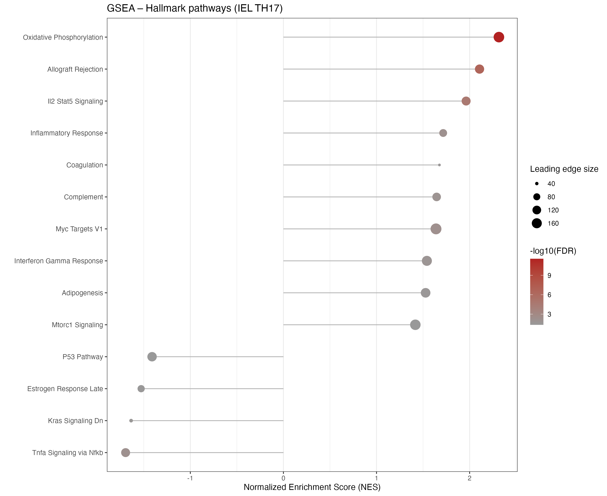

**Reactome**

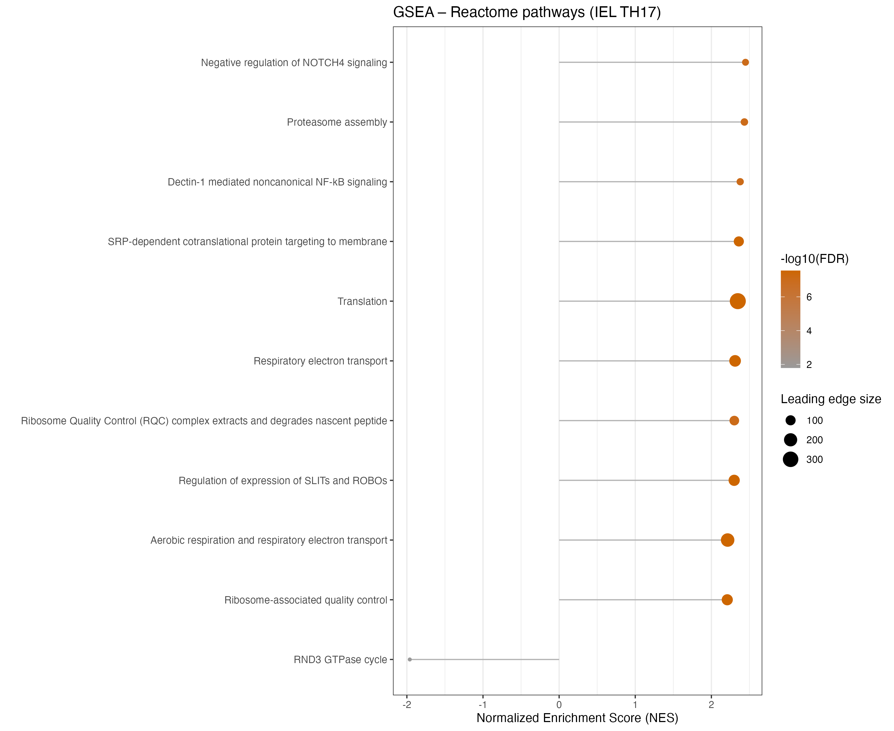

**GO Biological Process**

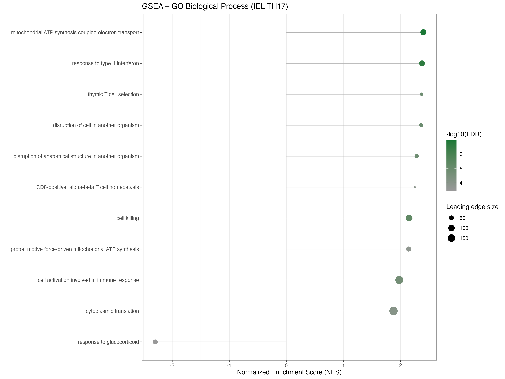

**C7 ImmunoSigDB**

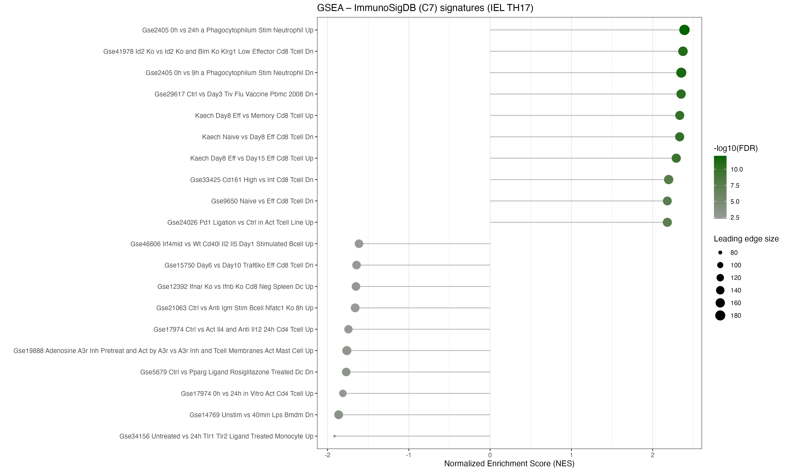

**Interpretation.** Hallmark shows Inflammatory Response, Interferon
Gamma Response, Allograft Rejection, Complement, and IL2-STAT5 Signaling
all up in CD — consistent with an activated, cytokine-driven TH17
phenotype. This matches Jaeger et al. (2021), who report that IEL CD39⁺
TH17 cells exhibit pathogenic effector features (GZMB, CCL4 expression)
and are increased in CD. Reactome shows a notable divergence between
NF-κB signaling branches: the non-canonical (NIK→noncanonical NF-κB
signaling) branch is up in CD, while Hallmark TNFA Signaling via NF-κB
is down — mechanistically distinct branches (non-canonical driven by
CD40/BAFFR/LTβR versus canonical TNFR1/IL1R signaling), and consistent
with the CD40-CD40L costimulatory axis reported to sustain TH17
differentiation in this tissue. GO (BP) additionally identifies
`CD8-positive, alpha-beta T cell homeostasis` as enriched, alongside C7
signatures dominated by CD8 effector differentiation comparisons (Kaech
Naive vs Effector); manual verification of the underlying cluster
composition indicated this population (Seurat clusters 4, 5, 11) is
annotated as CD4/TH17 lineage, with cluster 11 specifically labeled
TH17-like innate-associated — a plausible source of shared
innate/cytotoxic marker expression independent of true CD8 lineage
contamination, though this was not verified at the single-marker level
(`CD8A`, `NKG7`, `GZMK`) and is noted as an open question rather than a
resolved finding.

## 4.2 IEL-Cytotoxic-TRM-like

**Hallmark**

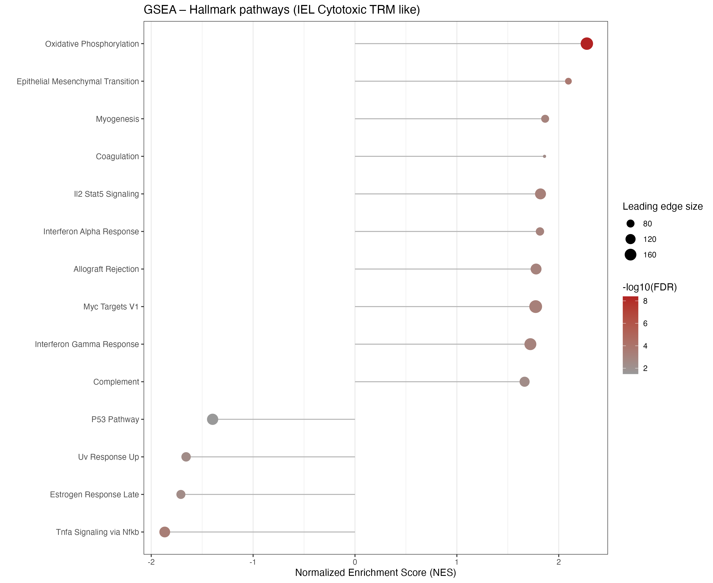

**Reactome**

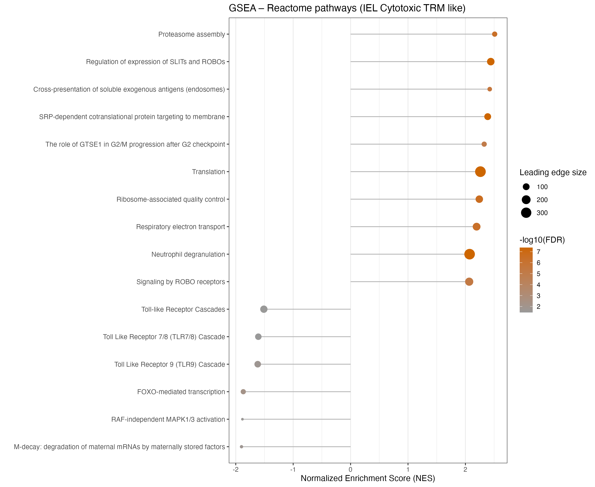

**GO Biological Process**

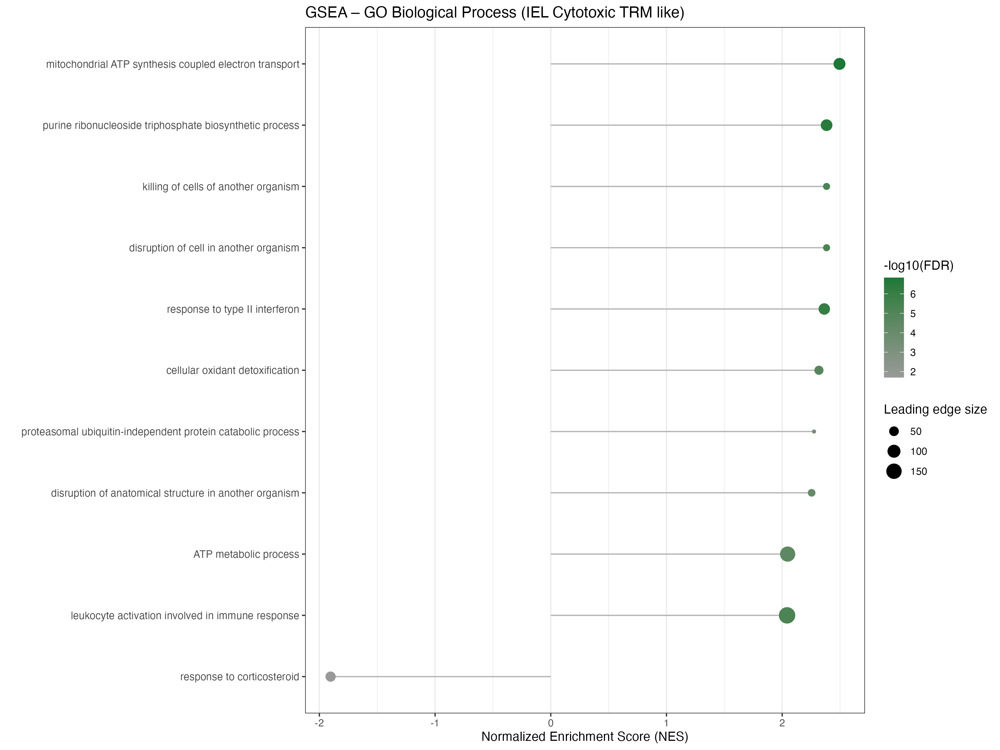

**C7 ImmunoSigDB**

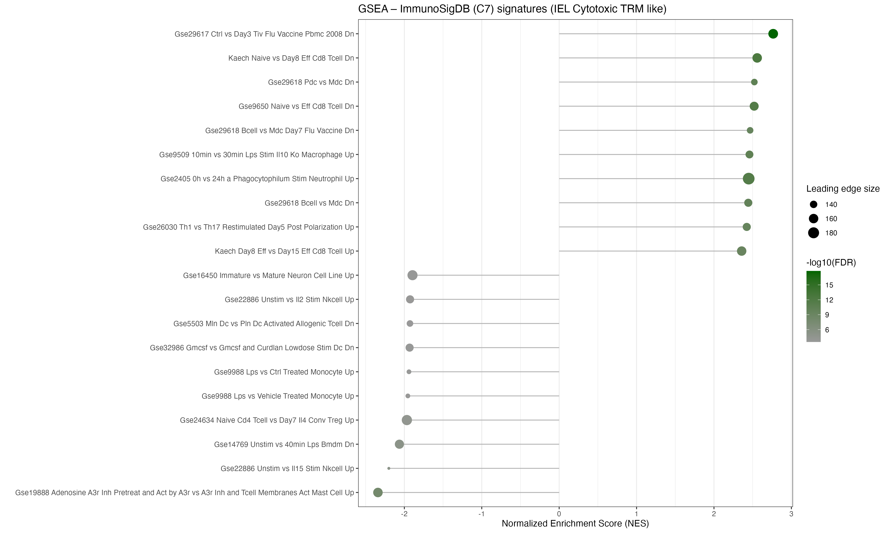

**Interpretation.** This population shows the strongest and most
database-consistent oxidative phosphorylation signature in the IEL
compartment (Hallmark Oxidative Phosphorylation, GO (BP)
`mitochondrial ATP synthesis coupled electron transport` and five
related redundant GO terms collapsing to the same theme after semantic
simplification, Reactome
`Aerobic respiration and respiratory electron transport`), alongside
Interferon Gamma Response, Allograft Rejection, and Complement, up in
CD. C7 signatures are dominated by “Naive vs Effector CD8” comparisons,
consistent with a shift toward an early/peak effector CD8 phenotype in
CD. GO (BP) additionally identifies `response to type II interferon`
(not type I), distinguishing this population from IEL-Cycling-T-cells
(Section 4.3), and `response to corticosteroid`/`glucocorticoid`, down
in CD — a pattern recurring across three of the five cell types analyzed
(Section 7.3).

**Compositional caveat (see also Section 9.2).** This macropopulation
aggregates two distinct T cell lineages: CD8 αβ tissue-resident effector
cells (Seurat clusters 0, 10, 14, 15) and cytotoxic γδ T cells (clusters
1, 2). Separating these into independent pseudobulk units was tested but
failed QC (the γδ subgroup was represented in only one donor).
Composition analysis showed that the relative proportion of γδ cells
within this macropopulation drops from 76.2% in Control to 37.6% in CD
(Table 1), a shift consistent in direction with the global reduction in
IEL γδ T cells reported in CD by Jaeger et al. (2021). The enrichment
results above should therefore be interpreted with the possibility that
part of the observed signal reflects compositional shift (relative
CD8:γδ proportions) rather than purely condition-driven transcriptional
reprogramming within a fixed population.

**Table 1. IEL-Cytotoxic-TRM-like composition by condition**

| Subpopulation       | CD (n cells, %) | Control (n cells, %) |
|---------------------|-----------------|----------------------|
| CD8 αβ TRM/effector | 3,512 (62.4%)   | 716 (23.8%)          |
| γδ cytotoxic        | 2,114 (37.6%)   | 2,298 (76.2%)        |

## 4.3 IEL-Cycling-T-cells

**Hallmark**

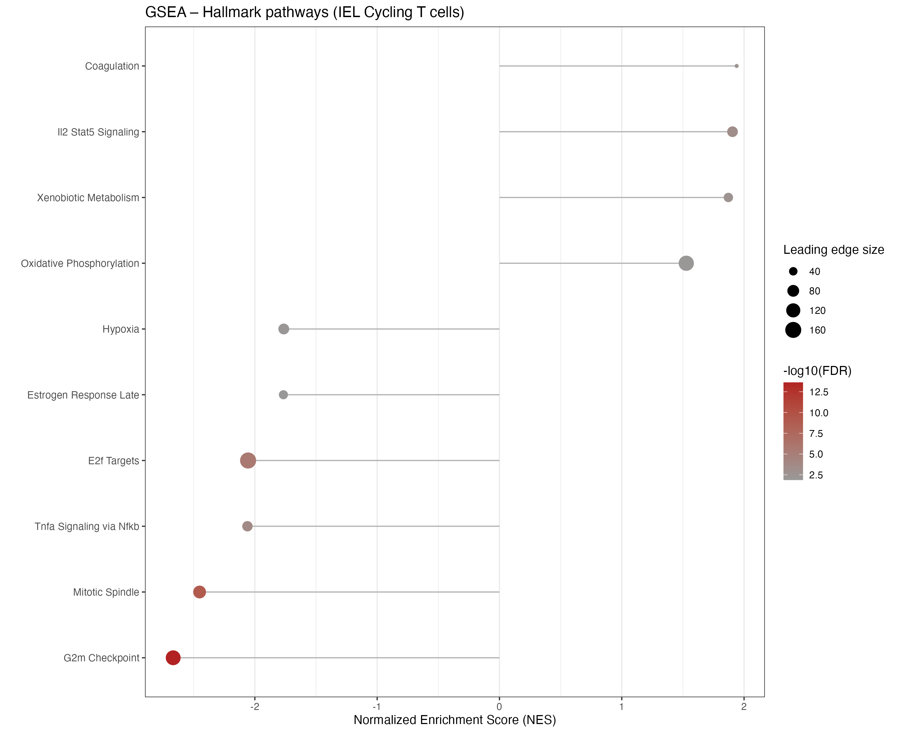

**Reactome**

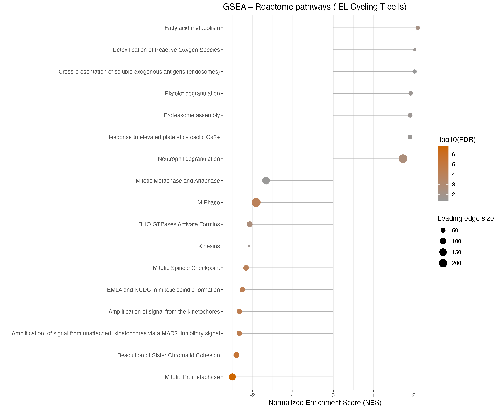

**GO Biological Process**

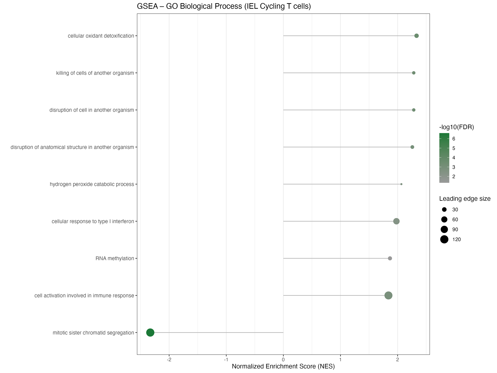

**C7 ImmunoSigDB**

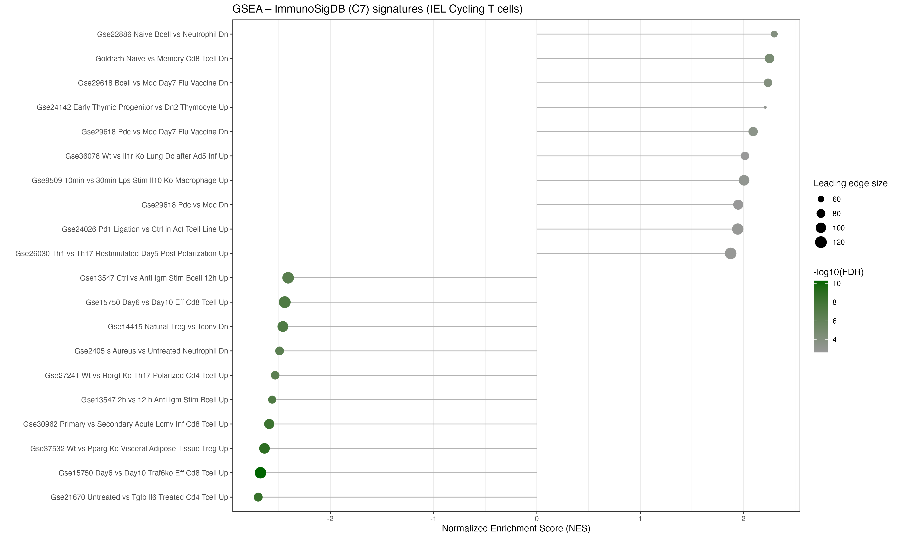

**Interpretation.** Three independent databases (Hallmark: G2M
Checkpoint, E2F Targets, Mitotic Spindle; Reactome: M Phase, Mitotic
Prometaphase, Resolution of Sister Chromatid Cohesion; GO (BP): mitotic
nuclear division and related chromosome segregation terms, collapsed by
semantic simplification) concordantly show a reduced mitotic machinery
signature in CD within this already-cycling population, with a parallel
increase in oxidative phosphorylation and fatty acid metabolism
(Hallmark, Reactome). This convergence across independent gene set
collections elevates this observation from speculative to
well-supported, although it does not correspond to a comparison
explicitly tested in Jaeger et al. (2021) and is presented as a novel,
hypothesis-generating finding of this dataset. GO (BP) additionally
identifies an antimicrobial/detoxification axis up in CD
(`killing of cells of another organism`,
`disruption of cell in another organism`,
`cellular oxidant detoxification`), together with
`response to type I interferon` — distinguishing this population’s
interferon signature from the type II response seen in
IEL-Cytotoxic-TRM-like and IEL-TH17 (Section 7.4). This antimicrobial
signature is consistent with the antibacterial properties reported for
S100A family members and IL-26 in this tissue system.

------------------------------------------------------------------------

# 5. LPL Compartment: Enrichment Results

## 5.1 LPL-Cytotoxic-TRM-like

**Hallmark**

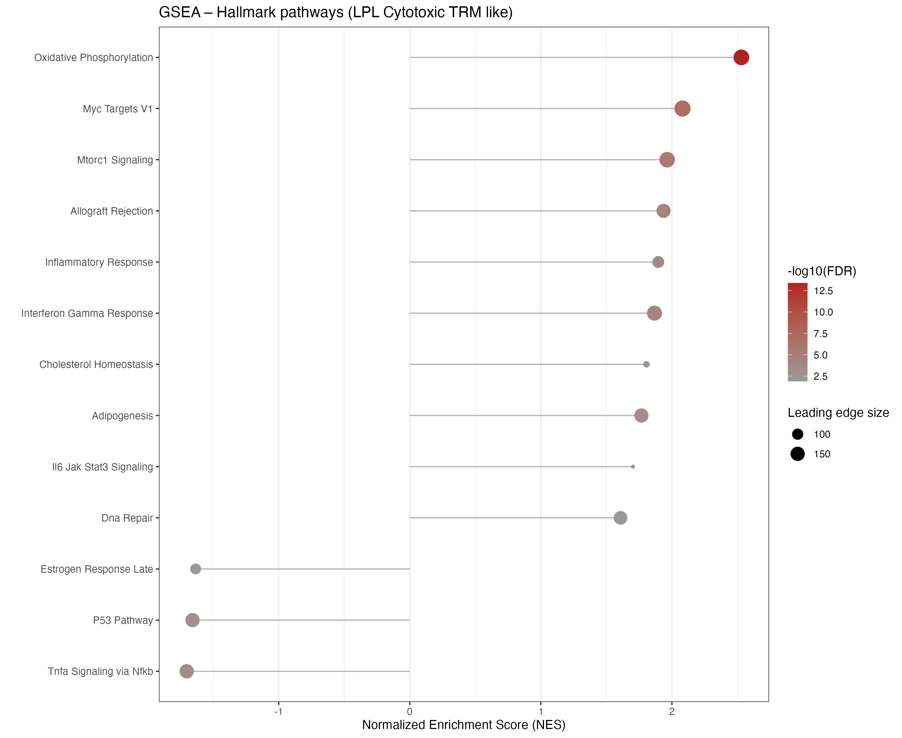

**Reactome**

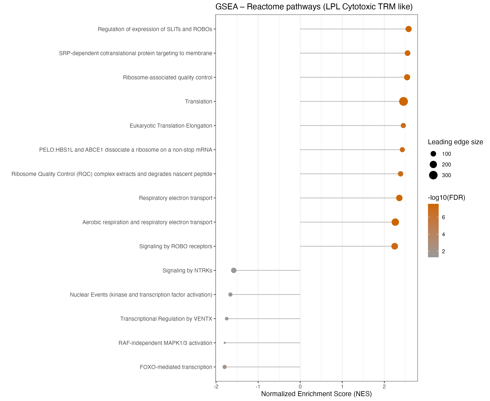

**GO Biological Process**

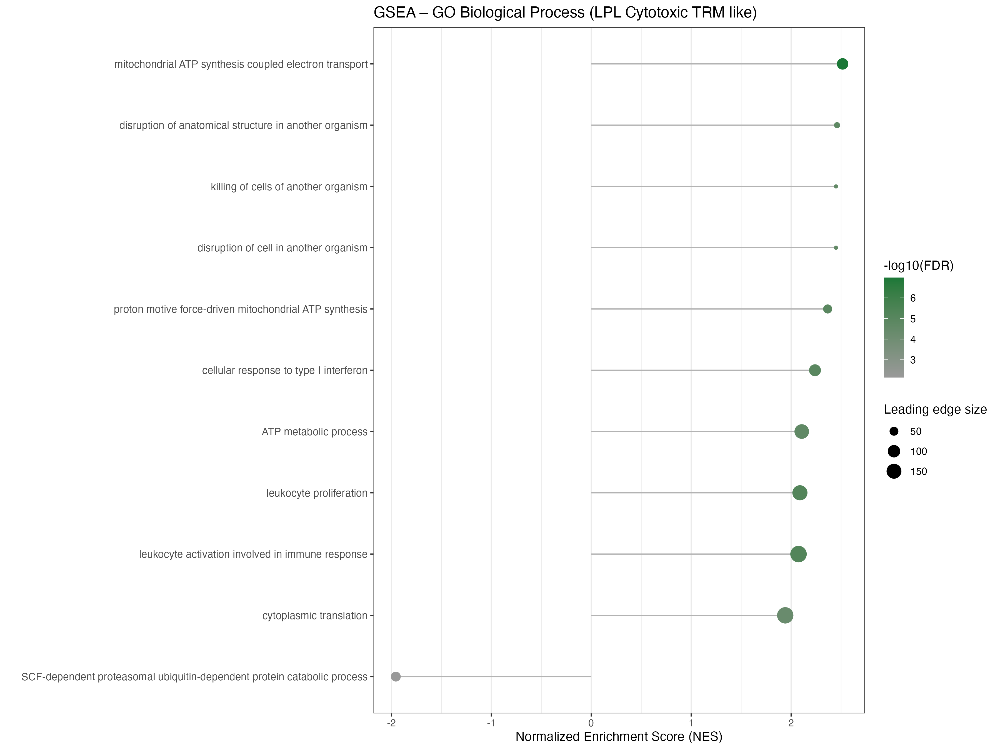

**C7 ImmunoSigDB**

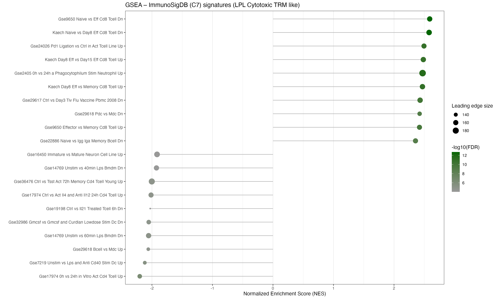

**Interpretation.** In contrast to IEL, where CD8⁺ IEL T cells are
globally reduced in CD, Jaeger et al. (2021) report an *increase* in LP
CD8⁺ resident T cells in CD (CyTOF-based expansion of multiple CD8⁺
clusters). The Hallmark profile obtained here is consistent with this
opposite compartmental trend: alongside the oxidative phosphorylation
signature shared across all cell types in this analysis, this population
additionally shows Myc Targets V1 and mTORC1 Signaling up in CD — the
canonical transcriptional axes of active clonal expansion, not observed
with comparable prominence in any IEL population. Reactome independently
supports this interpretation with a strong ribosome
biogenesis/translation program (Translation, SRP-dependent protein
targeting, Ribosome-associated quality control, Eukaryotic Translation
Elongation) up in CD — the same biological process described by two
independent databases, consistent with active proliferative/effector
expansion rather than a static metabolic shift alone. GO (BP) shows
`cellular response to type I interferon`, distinguishing this
compartment’s dominant interferon axis from the type II response more
typical of IEL populations (Section 7.4).

## 5.2 LPL-Treg

**Hallmark**

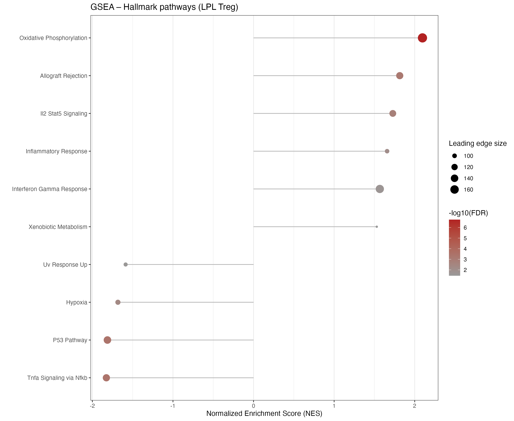

**Reactome**

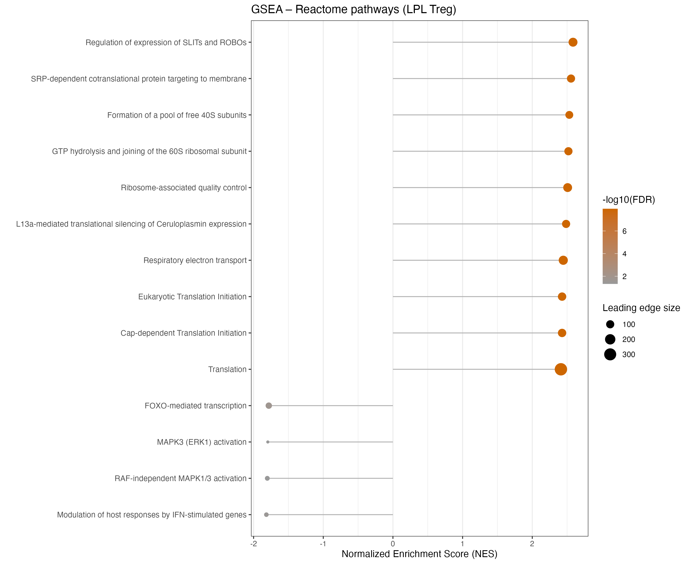

**GO Biological Process**

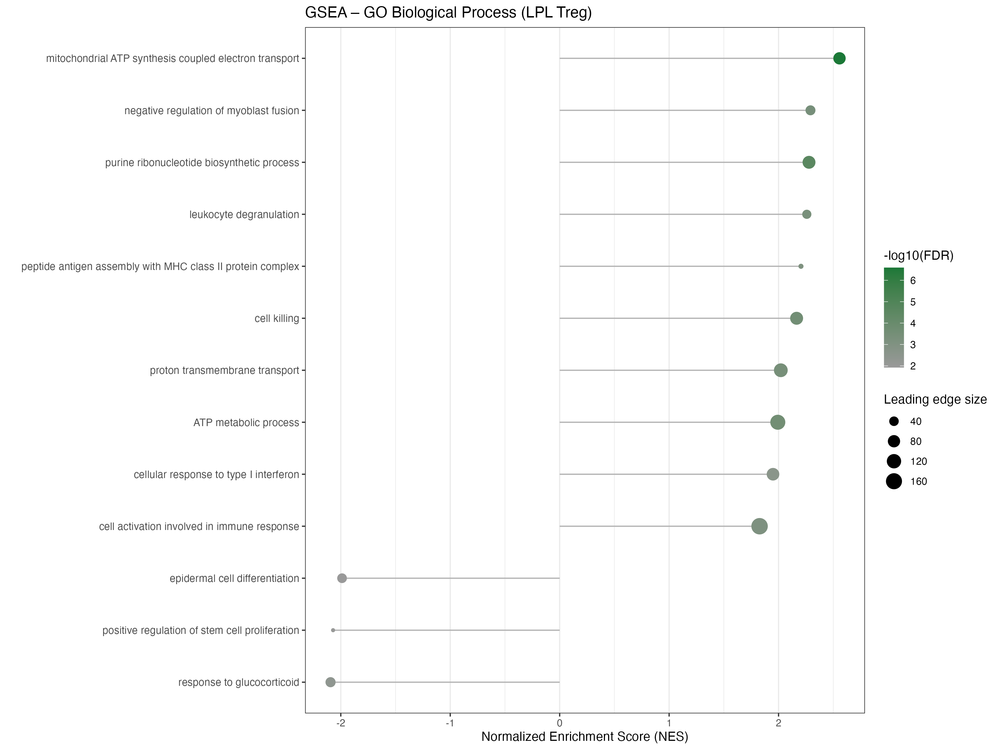

**C7 ImmunoSigDB**

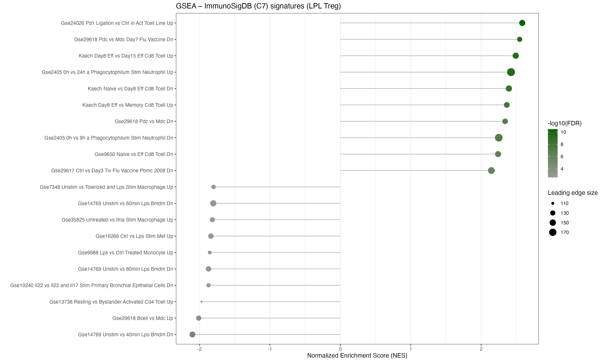

**Interpretation.** The most mechanistically specific finding in this
report: Hallmark IL2-STAT5 Signaling is up in CD within the Treg
population. IL-2/STAT5 signaling is the canonical molecular axis
maintaining Treg identity and function (FOXP3 expression itself is
STAT5-dependent), making this a targeted, interpretable signal rather
than a generic activation readout. Given that Jaeger et al. (2021)
report a reduced proportion of Treg cells in CD lamina propria, this
finding is consistent with residual Treg cells being those most actively
engaged via IL2-STAT5 signaling — either as an active but insufficient
compensatory regulatory response, or reflecting a biased survival of the
subset in which this axis is most engaged. GO (BP) additionally
identifies `peptide antigen assembly with MHC class II protein complex`
up in CD, consistent with an antigen-presentation- mediated tolerance
mechanism distinct from purely cytokine-based suppression. Reactome
repeats the same translation/ribosome biogenesis program observed in
LPL-Cytotoxic-TRM-like (Section 5.1), indicating this is a
compartment-level rather than cell-type-specific pattern distinguishing
LPL from IEL (Section 7.2).

------------------------------------------------------------------------

# 6. Comparison with Jaeger et al. (2021)

| Finding in this analysis | Jaeger et al. (2021) | Concordance |
|----|----|----|
| IEL-TH17: inflammatory/IFN-γ activation up in CD | CD39⁺ IEL TH17 increased, pathogenic effector features (GZMB, CCL4) in CD | Direct |
| IEL-Cytotoxic-TRM-like: γδ proportion drops 76.2%→37.6% (CD) | Global reduction of IEL γδ T cells in CD-inflamed tissue | Direct (compositional, quantified) |
| LPL-Cytotoxic-TRM-like: Myc/mTORC1/translation program up in CD | CD8⁺ resident T cells expanded (CyTOF) in LP of CD patients | Consistent, opposite-direction trend from IEL as expected |
| LPL-Treg: IL2-STAT5 signaling up in CD | Reduced Treg proportion in CD LP | Consistent (residual Treg under altered signaling) |
| IEL-Cycling-T-cells: reduced mitotic signature, antimicrobial/OXPHOS shift | Not directly tested in source paper | Novel, hypothesis-generating |

------------------------------------------------------------------------

# 7. Cross-Compartment Biological Synthesis

## 7.1 A universal oxidative phosphorylation signature

Across all five analyzed cell types, in both compartments and across
every database queried, an oxidative phosphorylation / mitochondrial ATP
synthesis signature is up in CD. This is the single most robust and
reproducible finding of the entire analysis and is proposed as the
primary, highest-confidence result of this study.

## 7.2 Compartment-level divergence in expansion programs

LPL populations (both Cytotoxic-TRM-like and Treg) show a shared
translation/ribosome biogenesis program not observed with comparable
strength in any IEL population, consistent with the qualitative
description of LP as a more actively regulatory, cytokine- and
expansion-driven niche relative to the more transcriptionally static,
tissue-resident IEL niche (Section 2, Subsetting report).

## 7.3 A recurring corticosteroid/glucocorticoid signature

`Response to corticosteroid`/`glucocorticoid` is down in CD in three of
the five cell types analyzed (IEL-Cytotoxic-TRM-like, IEL-TH17,
LPL-Treg), spanning both compartments. This pattern has plausible
clinical relevance given the known issue of corticosteroid resistance in
refractory CD, but is reported here as an observational,
hypothesis-generating signal rather than a mechanistically resolved
finding.

## 7.4 Type I versus type II interferon axis

A consistent distinction emerges between an interferon type II (IFN-γ)
response (IEL-Cytotoxic-TRM-like, IEL-TH17) and an interferon type I
response (IEL-Cycling-T-cells, LPL-Cytotoxic-TRM-like). This
fine-grained distinction is noted as an observation warranting further
investigation rather than a claim of distinct upstream regulatory
mechanisms.

------------------------------------------------------------------------

# 8. Deliverables

- Pre-ranked GSEA result tables (Hallmark, Reactome, GO (BP), C7) per
  cell type, per compartment
- Ranked gene lists (Entrez-mapped, `stat`-ordered) per cell type
- Lollipop enrichment plots per cell type per database (this report)
- Session information logs for full computational reproducibility

------------------------------------------------------------------------

# 9. Future Directions and Recommended Next Steps

The findings in this report point to specific, low-cost follow-up
analyses that would strengthen or resolve several observations flagged
as provisional above, without requiring new sequencing data.

## 9.1 Leading-edge gene verification

Two recurring signals require direct inspection of their leading-edge
gene sets before being reported as confirmed findings:

- **TNFA Signaling via NF-κB** (down in CD, 4/5 cell types): extract the
  leading-edge genes from the stored `hallmark_list` objects and check
  whether the signal is driven by negative feedback regulators
  (`TNFAIP3`, `NFKBIA`, `ZFP36`) versus canonical pro-inflammatory
  targets (`CXCL8`, `IL6`, `PTGS2`). The two scenarios support
  materially different biological narratives (chronic desensitization
  versus genuine pathway suppression).
- **Response to corticosteroid/glucocorticoid** (down in CD, 3/5 cell
  types): confirm the leading-edge set includes canonical
  glucocorticoid-responsive genes (`FKBP5`, `TSC22D3`) rather than a
  coincidental overlap with a differently-regulated process.

## 9.2 LPL compositional analysis

The compositional confound identified for IEL-Cytotoxic-TRM-like
(Section 4.2, Table 1) was not systematically checked for LPL
macropopulations. Given that LPL-Cytotoxic-TRM-like and LPL-Treg were
each consolidated from multiple Seurat clusters during annotation
(Subsetting Compartment report, Section 7.2), an analogous
cluster-by-condition composition table is recommended before treating
LPL enrichment results as free of compositional shift effects.

## 9.3 Cross-cell-type NES visualization

A single summary figure — a heatmap of NES values (pathway × cell type,
both compartments) restricted to the pathways discussed in Section 7
(oxidative phosphorylation, TNFA/NF-κB, corticosteroid response, type
I/II interferon) — would visually consolidate the cross-compartment
synthesis currently presented as text only.

------------------------------------------------------------------------

# 10. Limitations

## 10.1 Database-specific artifacts

**C7 (ImmunoSigDB)** is the noisiest of the four collections used: being
composed of thousands of heterogeneous pairwise comparisons from
unrelated experimental systems (e.g. neutrophils stimulated with *A.
phagocytophilum*, LPS-treated monocytes), it can capture generic
activation/metabolic programs shared across cell types rather than
genuine cell-state specificity. Thematically coherent C7 signatures
(e.g. Naive vs Effector CD8, Th1 vs Th17) were prioritized in
interpretation; thematically unrelated hits were treated with caution
and not reported as primary findings.

**“Regulation of expression of SLITs and ROBOs”** (Reactome) recurred
across all four Reactome analyses performed in this study (both
compartments, multiple cell types unrelated by lineage or condition
direction). Given axon-guidance biology has no plausible relevance to
this system, this is flagged as a likely structural artifact of the
Reactome gene set (probable overlap with generic hub signaling
regulators) rather than a genuine biological signal, and was excluded
from primary interpretation throughout this report.

**KEGG** was excluded from this analysis (Section 2.3); if required for
a specific downstream application, note the commercial licensing
requirement for non-academic use.

## 10.2 IEL-Cytotoxic-TRM-like lineage heterogeneity

As detailed in Section 4.2, this macropopulation aggregates CD8 αβ and
γδ T cell lineages, which could not be statistically separated due to
single-donor representation of the γδ subgroup. Enrichment results for
this population should be interpreted with this compositional caveat
explicitly in mind.

## 10.3 Computational considerations

Default GO (BP) GSEA parameters (`eps = 1e-10`) were computationally
intractable given the ~7,000+ GO (BP) term space combined with limited
local computational resources; `eps = 1e-4` combined with constrained
gene set size bounds (`minGSSize = 15`, `maxGSSize = 300`) was required
to obtain results in tractable time without materially affecting
downstream biological interpretation, since the precision lost concerns
only the exact magnitude of already highly significant p-values, not
their qualitative significance.

## 10.4 Not independently verified

The `TNFA Signaling via NF-κB` down-in-CD signal, recurring in four of
five cell types, has not been verified at the leading-edge gene level to
distinguish negative-feedback regulators (e.g. `TNFAIP3`, `NFKBIA`) from
canonical pro-inflammatory targets, and should be treated as provisional
pending this check.

------------------------------------------------------------------------

# 11. Reproducibility

Environment:

- R version: 4.6.0
- Seurat version: 5.5.0
- DESeq2 version: 1.52.0
- apeglm version: 1.34.0
- clusterProfiler version: 4.20.0
- fgsea version: 1.38.0
- msigdbr version: 26.1.0
- ReactomePA version: 1.56.0
- org.Hs.eg.db version: 3.23.1

All intermediate GSEA result objects are stored under:

`objects/pseudobulk/`

All visual outputs under:

IEL Compartment: `results/plots/GSEA_IEL/`  
LPL Compartment: `results/plots/GSEA_LPL/`

------------------------------------------------------------------------

# 12. Conclusion

Functional enrichment analysis of the IEL and LPL compartments
identifies a small set of robust, cross-validated transcriptional
programs associated with Crohn’s disease, most notably a universal
oxidative phosphorylation signature and multiple cell-type-specific
programs that independently reproduce findings from Jaeger et al.
(2021), including TH17 inflammatory activation, IEL γδ compositional
reduction, LP CD8⁺ expansion, and altered Treg IL2-STAT5 signaling.
These convergences, obtained across independent gene set databases and
against an independent literature source, constitute meaningful indirect
validation of the upstream clustering, annotation, and pseudobulk
differential expression framework, notwithstanding the explicitly
documented methodological limitations in Sections 10.2 and 10.3.

------------------------------------------------------------------------

# Appendix A: Glossary of Abbreviations

| Term | Definition |
|----|----|
| CD | Crohn’s disease |
| IEL | Intraepithelial lymphocytes |
| LPL | Lamina propria lymphocytes |
| TRM | Tissue-resident memory (T cell) |
| GSEA | Gene Set Enrichment Analysis |
| ORA | Over-representation analysis |
| NES | Normalized Enrichment Score |
| FDR | False discovery rate (Benjamini-Hochberg adjusted p-value) |
| HVG | Highly variable gene |
| C7 / ImmunoSigDB | MSigDB immunologic signature gene set collection |
| GO (BP) | Gene Ontology, Biological Process branch |
| Wald statistic (`stat`) | DESeq2 test statistic combining log2 fold change and its standard error |

------------------------------------------------------------------------

# Appendix B: File Manifest

**Result objects** (`objects/pseudobulk/`)

    GSEA_ranked_lists_IEL.rds       GSEA_ranked_lists_LPL.rds
    GSEA_hallmark_list_IEL.rds      GSEA_hallmark_list_LPL.rds
    GSEA_reactome_list_IEL.rds      GSEA_reactome_list_LPL.rds
    GSEA_GOBP_list_IEL.rds          GSEA_GOBP_list_LPL.rds
    GSEA_C7_list_IEL.rds            GSEA_C7_list_LPL.rds

**Result tables** (`results/tables/GSEA_IEL/`,
`results/tables/GSEA_LPL/`)

    GSEA_hallmark_H_<celltype>_<compartment>.csv
    GSEA_reactome_<celltype>_<compartment>.csv
    GSEA_GOBP_<celltype>_<compartment>.csv
    GSEA_C7_<celltype>_<compartment>.csv

**Figures** (`results/plots/GSEA_IEL/`, `results/plots/GSEA_LPL/`)

    GSEA_Hallmark_<celltype>.png
    GSEA_Reactome_<celltype>.png
    GSEA_GOBP_<celltype>.png
    GSEA_C7_<celltype>.png
    GSEA_enrichmentscore_top_<celltype>.png

**Session logs** (`results/logs/`)

    sessionInfo_GSEA_IEL.txt
    sessionInfo_GSEA_LPL.txt
