Ligand–Receptor Cross-Validation (LIANA) of Intestinal IEL and LPL
Compartments in Crohn’s Disease
================
Davide Maccarrone
2026-08-19

------------------------------------------------------------------------

# Executive Summary

This report presents the LIANA-based ligand–receptor cross-validation of
intraepithelial (IEL) and lamina propria (LPL) lymphocyte compartments
in Crohn’s disease (CD) versus control intestinal tissue, conceived from
the outset as an **orthogonal cross-method comparison** for the CellChat
v2 findings reported separately (*Cell–Cell Communication Analysis
(CellChat v2)…*, companion report). Where CellChat imposes a single
mass-action statistical model, LIANA aggregates five conceptually
independent scoring methods (CellPhoneDB, NATMI, Connectome, SCA, LogFC)
via RobustRankAggreg, deliberately excluding its own internal CellChat
reimplementation from the method set to preserve genuine cross-method
independence.

Two fully independent LIANA pipelines were run, one per compartment,
each following an identical four-stage structure: pooled
(non-donor-level) rank aggregation, global exploration, targeted
validation of the CellChat pathway deep-dive, and Hallmark
over-representation analysis (ORA) on the ligand/receptor gene subset.
Across both compartments, the analysis produces three categories of
outcome, all reported without selective filtering:

- **Confirmations**: MHC-I (both compartments), CDH1–ITGAE_ITGB7 (IEL),
  SIRPG–CD47 (LPL) are independently reproduced by LIANA using a fully
  distinct statistical framework and resource database — the strongest
  form of validation available in this project.
- **A genuine, three-method-arbitrated disagreement (IL2, LPL)**:
  LIANA’s receptor-complex pattern (high-affinity IL2RA_IL2RB_IL2RG
  specific to *both* Treg populations) contradicts CellChat’s original
  characterization (high-affinity complex specific to T follicular
  helper/CD4 TRM-like, not Treg). External literature (constitutive
  CD25/IL2RA expression on Treg, the textbook basis of Treg-selective
  IL-2 sensitivity) resolves this in LIANA’s favor — and GSEA
  independently corroborates it: `IL2_STAT5_SIGNALING` is significantly
  CD-enriched specifically in the **Treg** transcriptome (not in
  Cytotoxic TRM-like), placing the same pathway in the same population
  by a third, complementary ligand–receptor scoring methods (Section 7).
  GSEA and LIANA now agree with each other and with canonical
  immunology; CellChat’s receptor-complex assignment is the outlier on
  all three counts — a rare and instructive case where two orthogonal
  methods jointly outperform the primary one, reported as such rather
  than smoothed over.
- **A case where cross-validation caught and corrected a
  primary-analysis error (MHC-II, LPL)**: LIANA’s finding that Activated
  effector Treg receives substantial MHC-II signal in CD directly
  contradicted the original CellChat findings-log claim of “0
  interactions in CD” for this population. Rather than recording this as
  an unresolved LIANA–CellChat divergence, the discrepancy was traced
  back to the CellChat object itself via `subsetCommunication()`, which
  showed the original claim was **not supported by CellChat’s own
  output** (37 significant CD interactions vs 28 in Control, comparable
  magnitude). The correction — “MHC-II repertoire broadening in CD,” not
  “population substitution” — has already been propagated into the
  CellChat findings log and the CellChat final report (Sections 6.2 and
  10, companion report). This is the single most concrete demonstration
  in this project of why an orthogonal cross-method comparison was built
  in the first place.

Two further points define the boundaries of this analysis. First, an
unresolved tension worth flagging for the manuscript: for several
targeted pathway validations, the naive top-*N* ranking approach that
had worked cleanly for IEL’s exploratory dotplots proved unsuitable for
LPL’s pathway-specific cross-validation questions, because ubiquitous,
high-magnitude signals (generic MHC-I self-recognition, adhesion)
systematically outranked the weaker, biologically targeted pathways
under test — resolved by switching to direct gene-level filtering rather
than dotplot ranking for cross-validation questions specifically
(Section 8). Second, GSEA cross-validation (Section 7) is complete for
IEL and LPL compartments.

This report **does not introduce new computation**; it consolidates the
four analyst-produced documents (`LIANA_IEL_findings_log.md`,
`LIANA_IEL_pipeline_report.md`, `LIANA_LPL_findings_log.md`,
`LIANA_LPL_pipeline_report.md`) into a single, publication-oriented
narrative, structured identically to the CellChat final report for
direct cross-referencing.

------------------------------------------------------------------------

# Analytical Rationale

## Why LIANA as an orthogonal cross-method comparison

CellChat imposes a single statistical model (law-of-mass-action
communication probability, permutation test) and a single curated
database (`CellChatDB`). Any finding that depends on modeling choices
specific to that combination cannot, by construction, be distinguished
from a genuine biological signal using CellChat alone. LIANA addresses
this by combining five methods with different statistical bases
(permutation-based, edge-specificity-based, log-fold-change-based) over
an independently curated resource (`Consensus`, ~4700 interactions),
explicitly excluding its internal CellChat reimplementation from the
aggregated method set. A finding that survives both frameworks is
substantially more defensible than one supported by either alone; a
finding that does not survive is either a modeling artifact worth
flagging (as with IL2) or, in one case, evidence that the primary
finding itself needs correction (MHC-II).

## Pipeline architecture

- Two fully independent pipelines, one per compartment, each built as:
  manual `SingleCellExperiment` construction (bypassing a Seurat
  v5/`GetAssayData()` incompatibility — Section 8) →
  `liana_wrap(method = c("natmi","connectome","logfc","sca","cellphonedb"), resource = "Consensus")`
  → `rank_aggregate()` → global exploration (`heat_freq`, `chord_freq`)
  → targeted validation against the CellChat pathway deep-dive →
  `liana_bysample(sample_col = "disease")` for the CD-vs-Control split →
  Hallmark ORA on ligand and receptor gene subsets.
- **Design choice, not a limitation**: both compartments use a pooled,
  non-donor-level architecture. Verified against primary source
  (sc-best-practices.org, Cell–Cell Communication chapter): the
  underlying scoring methods were designed for steady-state,
  single-condition data; the tensor-based multi-condition extension
  (`tensor_cell2cell`) is an explicitly optional module, not the base
  workflow, and was not used — it also would not accommodate this
  dataset’s limited, shared donor structure across both compartments.
- Reproducibility: `set_seed(1234)` called identically in both
  compartments, consistent with the CellChat pipeline’s seeding
  convention.

## Scope and a key methodological asymmetry vs. CellChat

Both compartments use a `pmin(CD, Control) < 30` threshold to define the
“fully comparable” tier for CD-vs-Control dotplots and ORA — identical
logic and threshold in IEL and LPL, but **not identical to CellChat’s
own validity tables** for the same compartments (CellChat:
`filterCommunication(min.cells = 10)`, applied per-condition rather than
as a joint minimum). This is most consequential in LPL, where the LIANA
“fully comparable” set (7 populations) is substantially broader than
CellChat’s own “fully comparable” set (4 populations, Section 3.2 of the
companion CellChat report). This is not an inconsistency to silently
reconcile — it is declared explicitly in Section 3 below, and readers
should not assume the two reports’ “fully comparable” labels refer to
the same population set.

------------------------------------------------------------------------

# Methodological Framework: Cell Type Comparison Validity (LIANA-specific)

## IEL compartment

<table style="width:99%;">
<colgroup>
<col style="width: 32%" />
<col style="width: 32%" />
<col style="width: 32%" />
</colgroup>
<thead>
<tr>
<th>Tier</th>
<th>Cell types (n CD / n Control)</th>
<th>Interpretation</th>
</tr>
</thead>
<tbody>
<tr>
<td><strong>Fully comparable</strong> (
<code>min(CD,Control) ≥ 30</code>)</td>
<td>CXCL13⁺ TFH-like T cells (75/1394), GZMK⁺ effector memory CD8 T
cells (183/686), Effector T cell mixed state (213/356), Cycling T cells
(207/35)</td>
<td>Retained for the primary CD-vs-Control comparison</td>
</tr>
<tr>
<td><strong>Imbalanced</strong></td>
<td>
CD39⁺ tissue-resident CD8 T cells (2551/20), Cytotoxic γδ T cells
(2113/11), NK-like cytotoxic T cells (249/10), CST3⁺LYZ⁺ macrophages
(35/1), TH17 effector (4/1508),

others with <code>min &lt; 30</code>
</td>
<td>Comparison possible; weak side indicative only</td>
</tr>
<tr>
<td><strong>Condition-exclusive / quasi-exclusive</strong></td>
<td>FOXP3⁺ IL2RA⁺ Treg (79/0), Terminal effector CD8 T cells (529/0),
IL7R⁺ memory-like CD8 T cells (0/1481)</td>
<td>Within-condition characterization only</td>
</tr>
</tbody>
</table>

This table is identical in logic and, for IEL, in resulting population
set to the CellChat IEL validity table (companion report, Section 3.1) —
both compartments’ underlying cell composition tables are shared, and
IEL’s imbalance structure happens to produce the same practical grouping
under both criteria.

## LPL compartment

| Tier | Cell types (n CD / n Control) | Interpretation |
|----|----|----|
| **Fully comparable** (LIANA threshold, `min(CD,Control) ≥ 30`) | Activated cytotoxic CD8 T cells (5650/2002), Naive CD4 T cells (2284/3756), Activated effector Treg (873/617), CD4 TRM-like activated memory T cells (753/249), Th17-like activated CD4 T cells, IFN-activated CD8 cytotoxic T cells, γδ T cells / innate cytotoxic T cells | **Broader than CellChat’s own “fully comparable” set** (4 populations, companion report Section 3.2) — different validity criterion, declared explicitly, not to be treated as the same set |
| **Imbalanced** | Th17-like activated CD4 T cells (Control n=53), IFN-activated CD8 cytotoxic T cells (Control n=47), γδ T cells / innate cytotoxic T cells (Control n=57), Innate-like / TRM CD8 (2194 CD/16 Control), **Cycling T cells** | **Cycling T cells falls below the LIANA `<30` threshold** despite being treated as “well represented in both conditions” in the CellChat SIRP deep-dive — a direct instance of the two tools’ validity criteria disagreeing on a single population; declared rather than reconciled |
| **Condition-exclusive** | FOXP3⁺ activated Treg (n=0 Control), NK-like cytotoxic T cells (n=0 Control), TRM-like CD8 cytotoxic T cells (n=0 Control) | Within-condition characterization only; appearance of these populations in pooled or CD-only results must always be checked for compositional tautology before interpretation |

**Structural note (shared with CellChat).** LPL contains no myeloid or
epithelial populations; this is a genuine structural feature of the
compartment, not an analytical artifact, and constrains the LIANA global
exploration design identically to how it constrains CellChat’s (Section
3.2, companion report).

------------------------------------------------------------------------

# Global Network Architecture

|  | IEL | LPL |
|----|----|----|
| `heat_freq` dominant receivers (pooled, `sp ecificity_rank ≤ 0.05`) | CST3⁺LYZ⁺ macrophages, Epithelial cells — consistent with expected myeloid/epithelial structural role | No myeloid/epithelial hub (none present); diffuse T–T communication pattern |
| `chord_freq` design | Reused CellChat’s `celltypes_of_interest` set for consistency (mixed lineage) | Redefined on a T–T-only basis (no mixed-lineage analogue available) |
| `chord_freq` notable result | Not specifically flagged as informative beyond confirming global structure | Group 2 (Naive CD4 T cells, FOXP3⁺ activated Treg, Th17-like activated CD4 T cells): **Naive CD4 T cells appears visually isolated** after the joint `specificity _rank`/`magnitude_rank` filter — an independent LIANA-sourced confirmation of CellChat’s characterization of this population as having no dominant signal on any tested pathway |

**Figure 1a.**

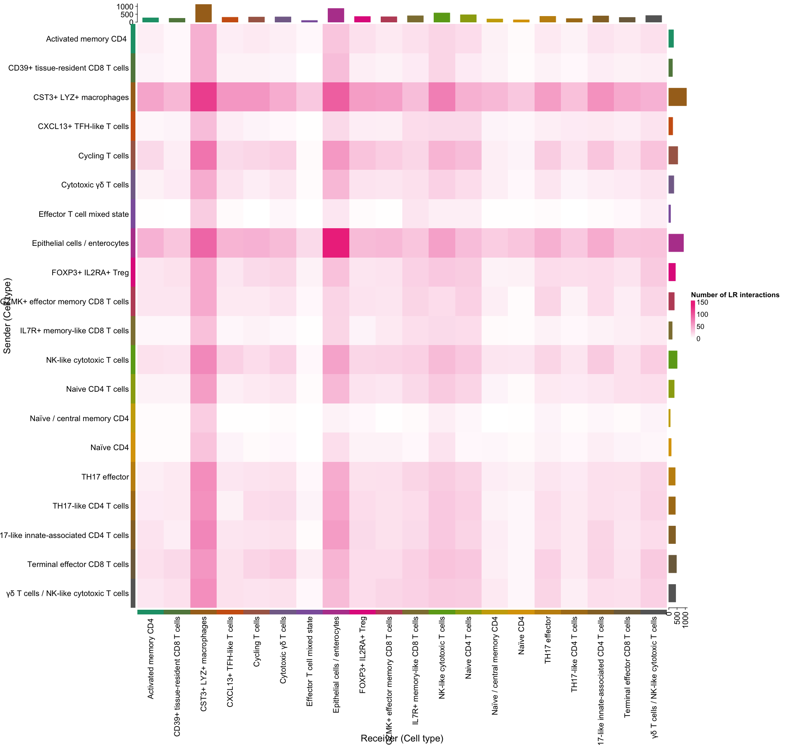

**Figure 1b.**

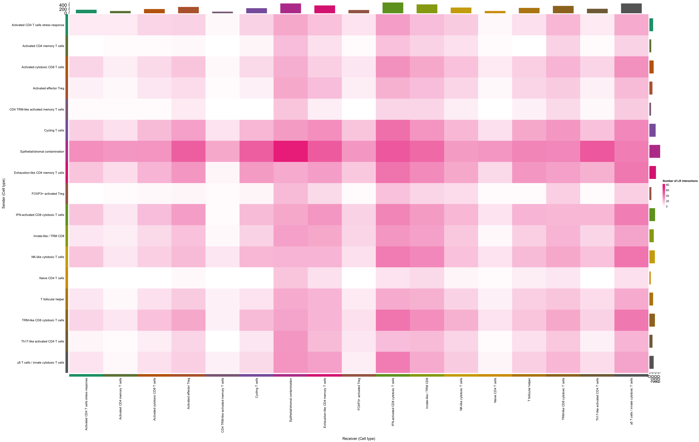

**Figure 2a.**

**Figure 2b.**

————————————————————————

# IEL Compartment: Validation, CD-vs-Control, and Enrichment Findings

## Targeted validation of the CellChat pathway deep-dive

| CellChat finding | LIANA outcome | Evidence |
|----|----|----|
| **MHC-I** (valid without caveat in CellChat) | **Confirmed independently**, no targeted filter needed | Dominates the unfiltered top-20 ranking and the `heat_freq` overview |
| **CDH1 → ITGAE_ITGB7** (most specific CellChat finding) | **Confirmed**, high specificity | `spe cificity_rank = 0.0048` (top ~0.5%); `magnitude_rank = 0.499` explains its absence from magnitude-ranked views despite being highly specific |
| **MHC-II** (CellChat: population substitution, TH17 effector → FOXP3⁺ Treg) | Signal present but **confounded by compositional constraint**, not independently testable | Treg (79 CD/0 Control) and TH17 effector (4 CD/1508 Control) are near-mutually-exclusive by construction — the CD-vs-Control receiver pattern in `liana_bysample()` is an arithmetic consequence of composition, not an independent finding |
| **LIGHT (TNFSF14) → LTBR** (“within-CD” in CellChat) | **Not testable**, cause diagnosed with certainty | Pair present in Consensus resource; TNFSF14 well-expressed in sender (20.6% CD39⁺TRM); **LTBR at 8.3% in CST3⁺LYZ⁺ macrophages, just below the default `expr_prop = 0.10` threshold** (1.7-point margin); re-tested on CD-only data still absent, making a pooling-related artifact unlikely |

**Figure 3.**
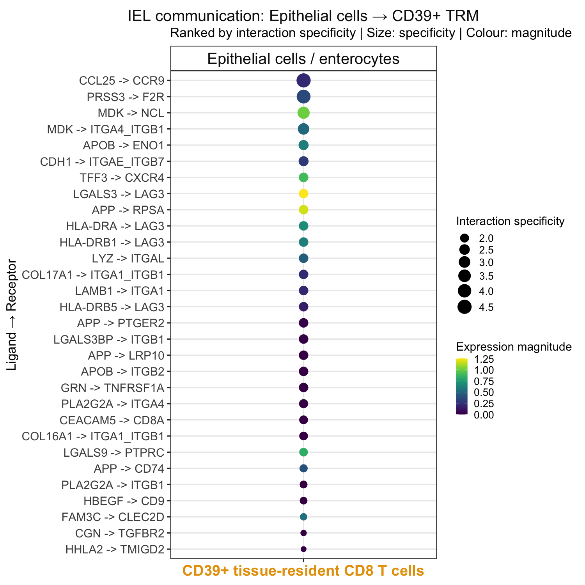
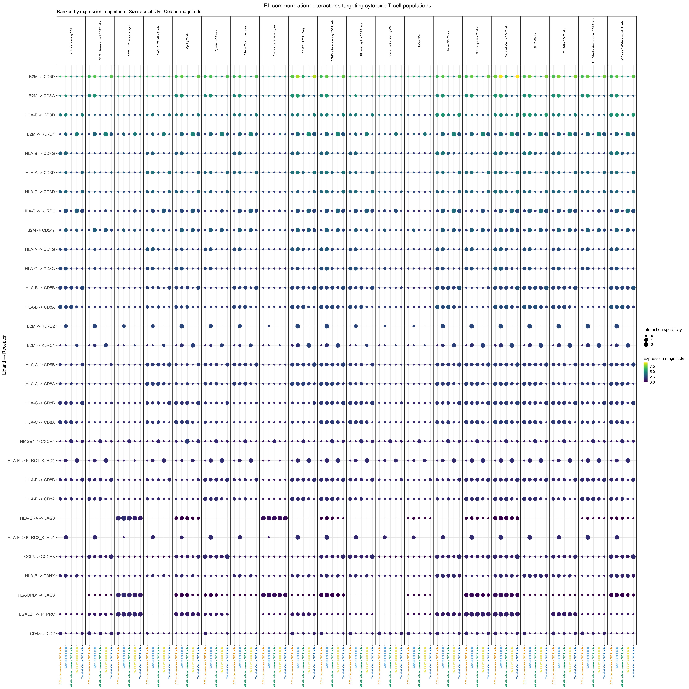
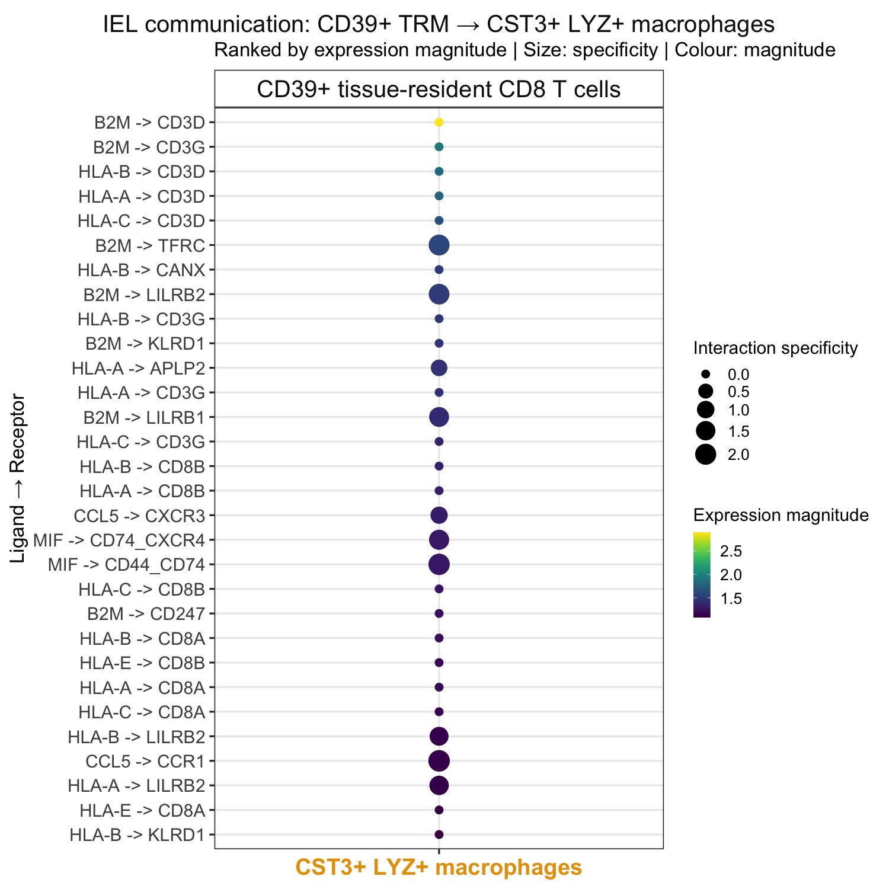
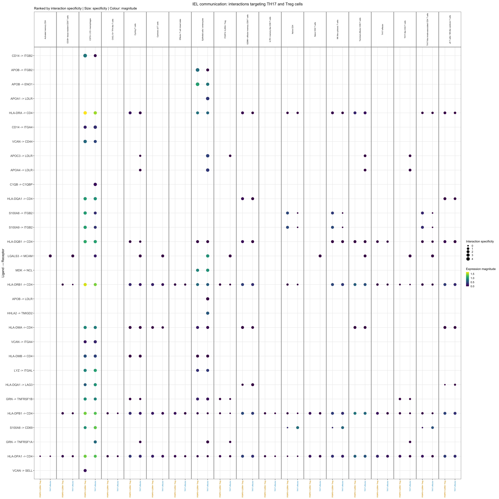

## CD-vs-Control comparison, three levels of granularity

1.  **Cytotoxic targets (MHC-I, magnitude-ranked)**: structure preserved
    between CD/Control, consistent with CellChat’s characterization of
    MHC-I as structural rather than condition-dependent — though the
    target set includes imbalanced/condition-exclusive populations and
    should be read with that caveat.
2.  **TH17 effector / Treg (specificity-ranked)**: **tautological**, not
    independent evidence — re-confirmed via `table(celltype, disease)`,
    the identical constraint already documented for CellChat.
3.  **Fully comparable set (4×4, both sides restricted)** — **the single
    most defensible CD-vs-Control comparison in the IEL analysis**: a
    **TNF-superfamily axis active in CD** (`LTA→TNFRSF1B`,
    `TNF→TNFRSF1B/ICOS`, `TNFSF13B→TFRC`, `ADAM10/17→IL6R`,
    `GZMB→IGF2R`) against a **regulatory/homeostatic axis in Control**
    (`IL10→CD27`, `FAM3C→PDCD1` checkpoint, `CXCL13→CXCR5/CXCR3`
    follicular homing). No CD-emergent populations involved — free of
    the compositional confounding affecting (2).

**Figure 4.**

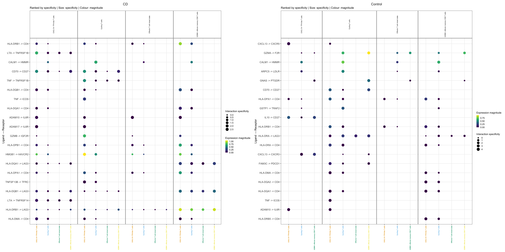

## Hallmark ORA (ligand and receptor side, `fully_comparable_types`)

- **Strongest finding**: CXCL13⁺ TFH-like T cells, receptor side — **4
  pathways exclusive to CD**, none in Control:
  `IL6_JAK_STAT3_SIGNALING`, `APOPTOSIS`, `MTORC1_SIGNALING`,
  `ALLOGRAFT_REJECTION`. IL6/JAK/STAT3 is a validated Crohn’s disease
  therapeutic target (tocilizumab, JAK inhibitors) — clinical
  concordance independent of the analysis design.
- **Declared caution**: `ALLOGRAFT_REJECTION` recurs across nearly every
  cell type tested — a broad, immune-centric gene set, expected given a
  background already restricted to immune ligand/receptor genes; treated
  throughout as “expected/control,” never as a discriminating finding on
  its own.
- **Fragile hit, quantified**: Effector T cell mixed state, ligand side,
  CD, `ALLOGRAFT_REJECTION` — `ligands_in_gs=2`, `distinct_hits=3`,
  `adj_pval=0.0475` (just below threshold) — reported as weak, not on
  par with the four CD-exclusive hits above.
- **Genuine negative result**: Effector T cell mixed state entirely
  absent from the receptor side (no Hallmark pathway above threshold in
  either condition) — tested and reported, not omitted.

**Figure 5.**

*Ligand*

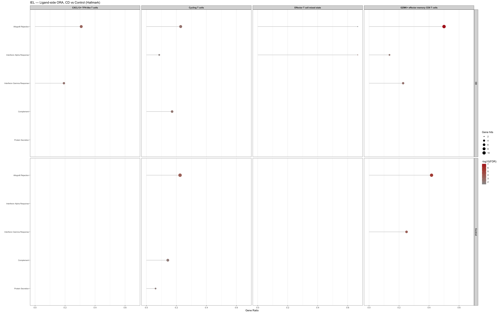

*Receptor*

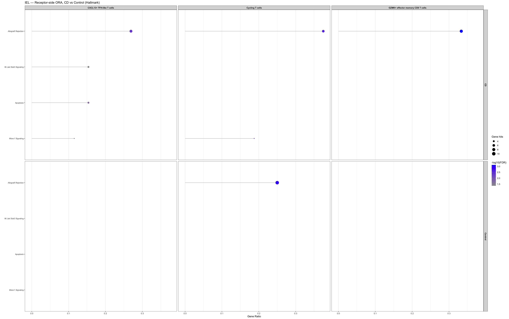

# LPL Compartment: Validation, CD-vs-Control, and Enrichment Findings

## Targeted validation of the CellChat pathway deep-dive

| CellChat finding | LIANA outcome | Evidence |
|----|----|----|
| **MHC-I on Activated effector Treg** (strongest quantitative LPL finding) | **Confirmed**, with a necessary distinction | Canonical HLA-A/B/C→CD8A/CD8B pairs present but `specificity_rank` near 1 (non-specific, ubiquitous) — consistent with CellChat’s own “broad, near-ubiquitous” characterization. The unfiltered top-30 ranking is instead dominated by **B2M→TFRC** and **HLA-A→APLP2** — verified via `select _resource("Consensus")` as genuinely curated (CellPhoneDB + connectomeDB2020) but biologically distinct: the B2M–HFE–TFRC iron-homeostasis axis, not MHC-I antigen presentation. The MHC-I claim must be anchored to the HLA-\*→CD8A/CD8B rows specifically, never to B2M→TFRC/APLP2. |
| **IL2** (CellChat: high-affinity IL2RA–IL2RB specific to T follicular helper/CD4 TRM-like, not Treg) | **Disagreement, resolved in LIANA’s favor by external literature** | LIANA shows the opposite pattern: the full high-affinity trimeric complex **IL2RA_IL2RB_IL2RG** is specific to **both** Treg populations (Activated effector Treg and FOXP3⁺ activated Treg, `spec ificity_rank = 0.00802` in both), while T follicular helper/CD4 TRM-like show only the intermediate-affinity IL2RB_IL2RG/CD53. Literature verification: Treg constitutively express CD25/IL2RA, the textbook basis of the Treg-selective high-affinity trimeric receptor — the LIANA pattern is the biologically canonical one; CellChat’s is inverted relative to established immunology, plausibly reflecting receptor-complex annotation differences between `CellChatDB` and `Consensus`. Additionally, CellChat’s “0 interactions in Control” claim (CD-exclusive) is better stated, per LIANA, as “markedly attenuated but not absent” (`magnitude_rank` near 1 in Control vs 0.4–0.6 in CD) rather than strictly absent. |
| **SIRPG–CD47** (CellChat: network reorganization among Cycling T cells, CD4 TRM-like, Activated effector Treg) | **Confirmed**, with an additional supporting detail | Pair present in both conditions among the three core populations. In CD, CD4 TRM-like activated memory T cells does not act as a sender (only Activated effector Treg and Cycling T cells send), while all three send in Control — a second, independent line of evidence for CellChat’s “reorganization, not simple loss” reading (rankSimilarity), not merely a magnitude reduction. |
| **MHC-II** (CellChat original claim: population substitution, Activated effector Treg in Control → FOXP3⁺ activated Treg in CD) | **Original CellChat claim found unsupported by CellChat’s own object — corrected**, not a LIANA-CellChat divergence | LIANA showed substantial, significant MHC-II signal toward Activated effector Treg in CD (multiple HLA- DRB1/DPB1/DPA1/DQB1→CD4 rows, `specificity_rank` 0.005–0.02), contradicting “0 interactions in CD.” Direct verification via `subsetComm uni cation(cellchat_lpl_ cd /ctrl, signaling="MHC - II", targets.use="Acti vated effector Treg")`: **confirmed Activated effector Treg receives MHC-II in both conditions** — CD: 37 significant interactions (`pval=0`) from 9 senders; Control: 28 from 6 senders; comparable magnitude order between conditions. Part of the sender-side CD expansion is tautological (two of three new CD senders are CD-exclusive populations by construction); the sole non-tautological addition is autocrine signaling (Treg→itself), CD-only. **Corrected reading**: repertoire broadening, not population substitution — already propagated to the CellChat findings log and final report (Sections 6.2, 10, companion report). |

**Figure 6.**
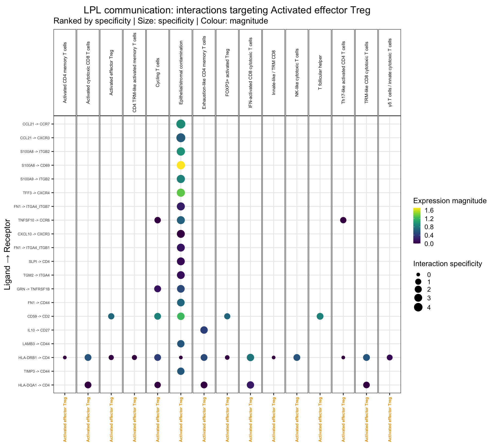
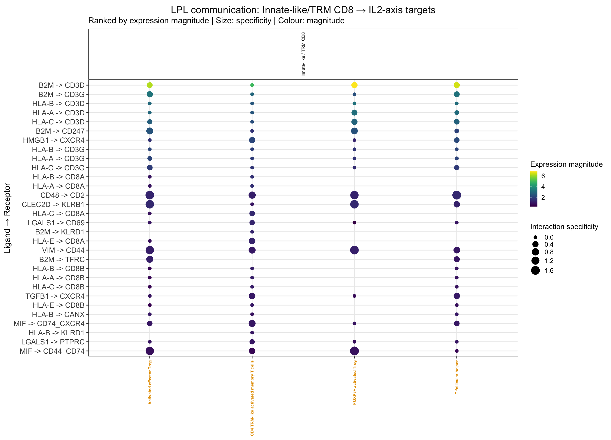
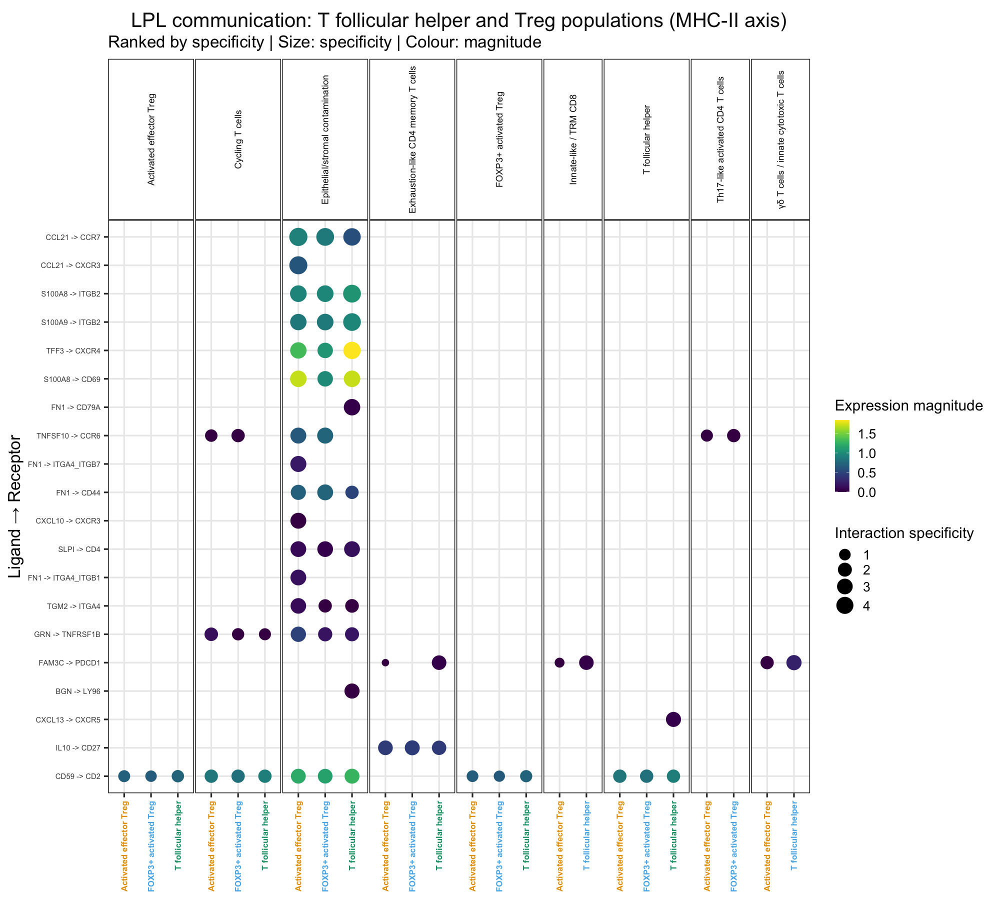
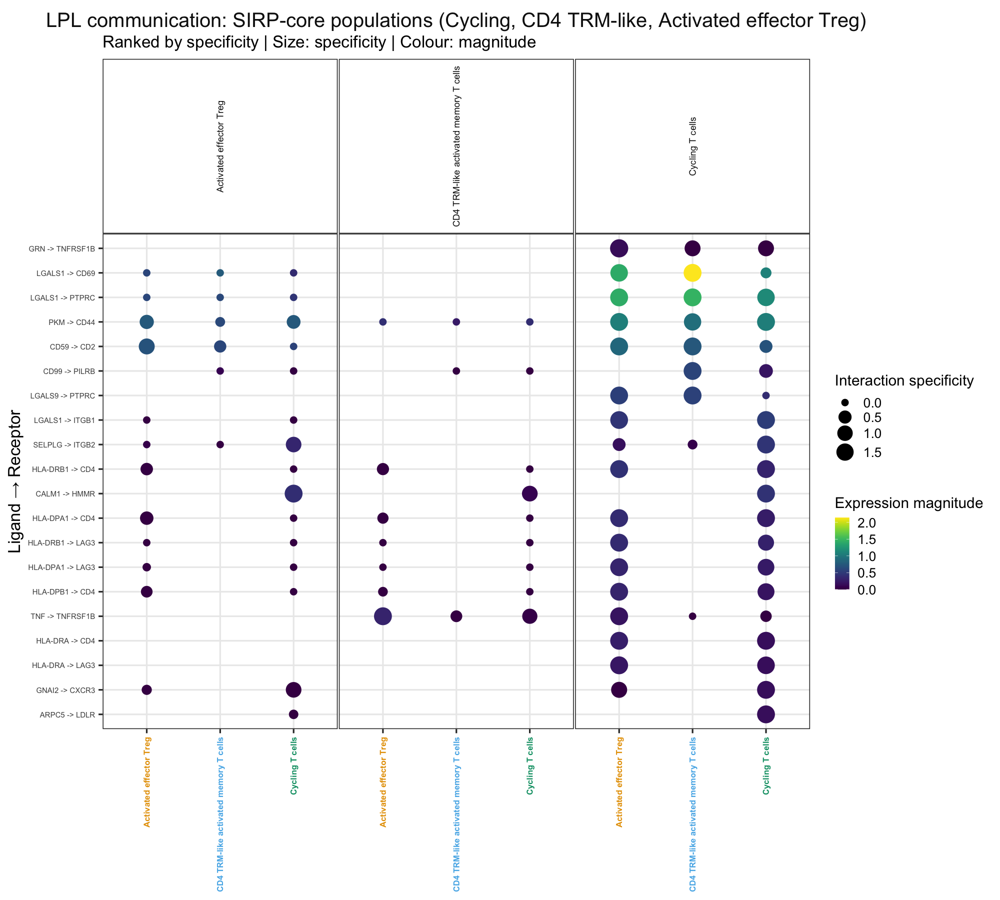

## CD-vs-Control comparison (`fully_comparable_types_lpl`, 7 populations)

Combined dotplot generated with the identical `liana_bysample()`
split/tier-filter schema used for IEL. Must be read with the Section 3.2
caveat on threshold divergence from CellChat’s own validity table. The
observed pattern (dominance of MHC-I/MHC-II/adhesion signal in both
conditions, differing more in magnitude than presence/absence) is
consistent with the targeted deep-dive in Section 6.1.

**Figure 7.**

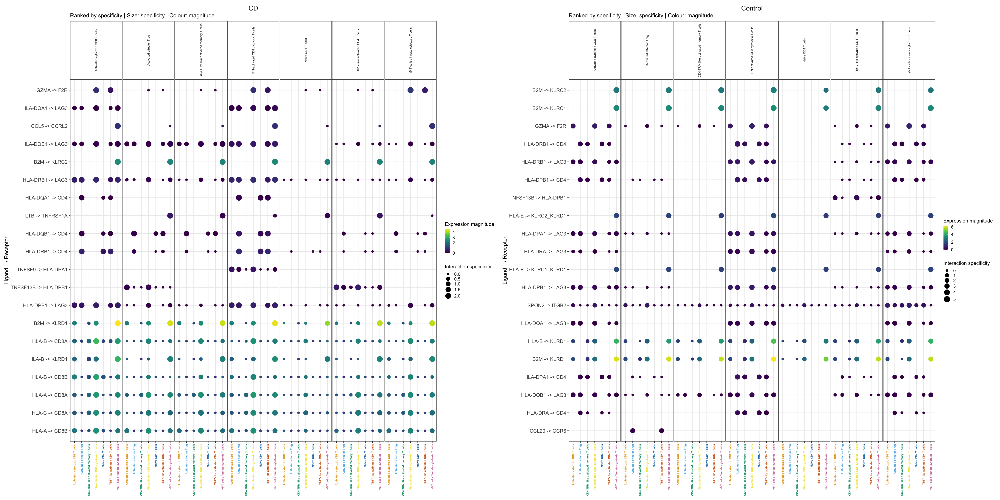

## Hallmark ORA (ligand and receptor side, `fully_comparable_types_lpl`)

`ALLOGRAFT_REJECTION` dominates nearly every population/condition panel
in both directions — flagged initially as a possible structural artifact
of a background already restricted to immune-recognition genes, then
resolved by gene-level decomposition of the intersecting hits:

- **Generic, uninformative core, shared everywhere**: B2M, HLA-A, HLA-E,
  LCK — identical across Treg-CD, Naive CD4-CD, Treg-Control; not
  discriminating.
- **TGFB1**: present on Activated effector Treg in *both* conditions,
  absent on Naive CD4 T cells — consistent with Treg identity, stable
  rather than disease-differential; a methods-validation signal rather
  than a disease finding.
- **IL10**: present *only* on Activated effector Treg in Control, absent
  in CD — **the strongest ORA finding in LPL**, convergent with the
  independently observed IL10 loss in the CellChat rankNet analysis
  (companion report, Section 6.5/GSEA cross-validation note; originally
  flagged there as fragile, one interaction) — two independent sources
  now support attenuated anti-inflammatory tone in this population
  during active inflammation.
- **CD47, ITGB2, HLA-DMA**: newly present on Treg-CD vs Treg-Control —
  CD47 convergent with the already-confirmed SIRPG–CD47 axis (Section
  6.1).
- **TNF, TIMP1**: present only on Naive CD4-CD, not Treg —
  population-specific differentiation, arguing against a blanket
  structural artifact.
- **Statistically null result, not a data gap**: the receptor-side ORA
  plot lacks panels for CD4 TRM-like activated memory T cells and
  Th17-like activated CD4 T cells; verified directly
  (`ora_receptor_compare |> filter(...)`) — rows exist but none clear
  `adj_pval < 0.05` (minimum observed 0.0654), consistent with a small
  `distinct_hits` denominator (8 and 13/24) rather than absence of
  signal.

**Figure 8.**

*Ligand*

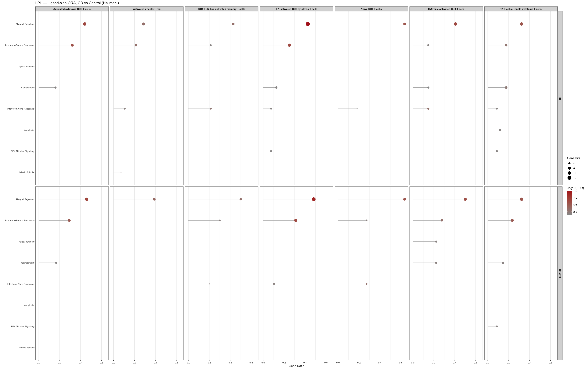
*Receptor*

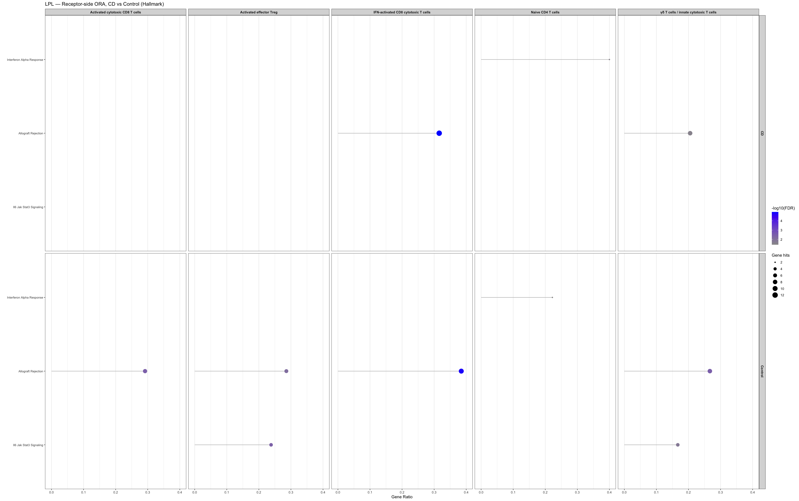

## 7. Cross-Validation with GSEA

**IEL — complete.** The recurring pattern shared between the three
available GSEA cell types (Cycling T cells, Cytotoxic TRM-like, TH17)
and the LIANA ligand-side ORA (`ALLOGRAFT_REJECTION`,
`INTERFERON_GAMMA_RESPONSE`, `INTERFERON_ALPHA_RESPONSE`, `COMPLEMENT`,
all CD-enriched) is treated as a plausible, expected convergence of
broad gene sets rather than an independently informative one (same
caution as Section 5.3). A genuine, unresolved tension is flagged rather
than forced to a conclusion: `TNFA_SIGNALING_VIA_NFKB` is **negative**
in CD across all three GSEA cell types, while both the LIANA ORA and the
balanced CD-vs-Control dotplot show a TNF-superfamily axis
**active/present** in CD at the co-expression level — plausibly
reflecting two distinct biological layers (potential communication via
L-R co-expression vs. measured downstream NFkB transcriptional
response), stated in the manuscript as an open question, not resolved
either way.

**LPL — complete.** GSEA (DESeq2 pseudobulk, Hallmark, `NES` positive =
enriched in CD, same convention as IEL) is available for two LPL cell
types: Cytotoxic TRM-like and Treg.

- **Generic/expected convergence with the LIANA ORA (Section 6.3)**:
  `ALLOGRAFT_REJECTION` is strongly CD-enriched in both GSEA cell types
  (Cytotoxic TRM-like: NES≈2.0; Treg: NES≈1.8), mirroring its
  near-ubiquitous dominance in the LIANA ligand-side ORA. Same caution
  applies as everywhere else this gene set appears in this report —
  expected given a broad, immune-centric gene set, not independently
  discriminating on its own. `INTERFERON_GAMMA_RESPONSE` shows the same
  pattern (positive NES in both GSEA cell types; also recurrent in the
  LIANA ORA on Activated effector Treg and several other populations) —
  plausible convergence, same generic-gene-set caveat.

- **The most important result of this section: a three-way convergence
  on IL2 being Treg-specific, contradicting CellChat’s original
  characterization.** `IL2_STAT5_SIGNALING` is significantly CD-enriched
  specifically in the **Treg** transcriptome (NES≈1.7) and does **not**
  appear among the top Hallmark hits for Cytotoxic TRM-like — i.e., GSEA
  independently places this transcriptional program in Treg
  specifically, not in a CD8/cytotoxic population. This aligns directly
  with LIANA’s finding (Section 6.1) that the high-affinity
  IL2RA_IL2RB_IL2RG receptor complex is specific to both Treg
  populations, and with the external-literature basis for that reading
  (constitutive CD25/IL2RA on Treg). It contradicts CellChat’s original
  pathway characterization (high-affinity complex assigned to T
  follicular helper/CD4 TRM-like, not Treg) on a second, independent
  axis. **Taken together, GSEA and LIANA now agree with each other and
  with canonical immunology; CellChat’s original receptor-complex
  assignment is the outlier on all three counts.** This upgrades the IL2
  finding from “LIANA disagrees with CellChat, literature favors LIANA”
  (Section 6.1/9) to a genuinely converging three-method picture, and is
  worth revisiting in the companion CellChat report’s Section 7, which
  currently frames the GSEA–CellChat IL2 relationship as only a
  “partial, not clean” directional convergence — that framing was
  written before this LIANA/literature arbitration and likely undersells
  how one-sided the evidence now is.

- **`TNFA_SIGNALING_VIA_NFKB` is negative in CD in both LPL cell types**
  (Cytotoxic TRM-like NES≈-1.6; Treg NES≈-1.8) — consistent with, not in
  tension with, the LPL CellChat/LIANA picture: unlike IEL (Section 7,
  IEL), no LPL deep-dive pathway claims an *active* TNF-superfamily
  ligand–receptor axis in CD to create a comparable tension. The
  companion CellChat report already notes that canonical
  TNF/IFNG/IL17/TGFb signaling is undetected by CellChat in **both**
  compartments (Section 2.2/10, companion report) — the LPL GSEA result
  is therefore compatible with that absence, not contradictory to it.
  The IEL-specific TNF/NFkB tension (Section 7, IEL above) should
  **not** be generalized to LPL in the manuscript.

- **Metabolic/proliferative programs exclusive to GSEA** (Oxidative
  Phosphorylation — the strongest hit in both cell types by FDR; Myc
  Targets V1, MTORC1 Signaling, DNA Repair, Adipogenesis, Cholesterol
  Homeostasis) have no ligand/receptor equivalent and are not testable
  against LIANA or CellChat by construction — reported here for
  completeness, not as cross-validated findings.

------------------------------------------------------------------------

# Known Technical Issues (LIANA) — Methods Note

Documented for reproducibility; several apply identically to both
compartments, one is LPL-specific.

1.  **Seurat v5 / `GetAssayData()` incompatibility** (both
    compartments): `as.SingleCellExperiment()` and direct `liana_wrap()`
    on a Seurat v5 multi-layer object fail — known issue on both the
    Seurat and LIANA repositories. *Fix*: manual `SingleCellExperiment`
    construction via `LayerData()`.
2.  **Incomplete `counts` layer** (both compartments): the
    compartment-subset Seurat objects had `data` already joined across
    samples but `counts` still split, with some samples entirely
    missing. *Fix*: raw counts recovered from the full integrated object
    (`srt_obj_merge_harmony.rds`), rejoined, subset by barcode, with an
    explicit `colnames`/`rownames` identity check before proceeding.
3.  **`liana_dotplot()` default columns point to single-method scores**
    (`natmi.edge_specificity`/`sca.LRscore`), not the aggregated ranks —
    unless
    `magnitude="magnitude_rank", specificity="specificity_rank", invert_*=TRUE`
    are explicitly set, plots reflect consensus only in point ordering,
    not in color/size. Corrected in all plots from the point of
    detection onward.
4.  **Facet illegibility beyond ~5–7 cell types**, in both dotplot and
    chord visualizations — `source_groups`/`target_groups` restricted to
    3–6 populations per side throughout; `chord_freq()` in particular
    does not render a legend (a `circlize` limitation, not LIANA’s),
    compensated with text captions.
5.  **`facet_grid(..., scales="free_y")` disalignment** in CD-vs-Control
    comparative plots — removed in favor of shared, fixed scales with
    pathway order fixed explicitly via `factor(..., levels=...)`.
6.  **String mismatch in cell type name (LPL-specific)**:
    `"Innate-like/TRM CD8"` (no spaces around the slash, as typed in
    code) vs. `"Innate-like / TRM CD8"` (actual level, with spaces) —
    caused a silent zero-row filter and a downstream
    `Error in combine_vars(): Faceting variables must have at least one value`.
    Diagnosed via `sort(unique(...))` and a direct row-count check;
    corrected throughout.
7.  **Generic top-*N* ranking is unsuitable for pathway-specific
    cross-validation questions (LPL-specific)**:
    `liana_dotplot(ntop=...)` ranks across *all* L–R pairs within the
    chosen source/target subset, not within a specific pathway —
    ubiquitous signals (MHC-I self-recognition, CD59-CD2/CD48-CD2
    adhesion) systematically outrank weaker, targeted pathways (IL2: 11
    CellChat interactions total; SIRP: a single L–R pair). *Resolution*:
    for exploratory questions (“what dominates here”), top-*N* ranking
    remains appropriate (IEL dotplots, Section 5; LPL Section 6.2); for
    pathway-specific cross-validation, direct `filter() + str_detect()`
    querying of `magnitude_rank`/`specificity_rank` was used instead
    (Section 6.1), the same pattern already used for IEL’s targeted
    LIGHT-LTBR diagnosis.
8.  **Enrichment script file-naming carryover (LPL-specific,
    resolved)**: `22_LIANA_LPL_enrichment.r`, adapted from the IEL
    script, retained six residual `"IEL"` string occurrences in
    `save_rds()` calls, `save_session_info()`, and the final pipeline
    message. Flagged during this analysis and **confirmed corrected by
    the analyst** — no longer a reproducibility risk.

------------------------------------------------------------------------

# Comparison with External Literature

| Finding (this analysis) | Independent literature | Concordance |
|----|----|----|
| MHC-I as broad, near-ubiquitous signal, both compartments | Consistent with the well-established near-universal expression of classical MHC-I on nucleated cells; not a disease-specific claim | Expected, structural |
| CDH1(E-cadher in)–CD103(ITGAE_ITGB7), IEL | Established retention mechanism for intraepithelial lymphocytes and CD103⁺ Tregs (Yang et al., *Immunity* 2025) — same literature basis already cited in the CellChat companion report, Section 5.6/9 | Direct mechanistic support, cross-method confirmed |
| IL2 receptor-complex pattern specific to Treg populations, LPL | Constitutive CD25(IL2RA) expression on Treg and the resulting high-affinity IL2RA-IL2RB-IL2RG trimeric receptor is textbook immunology, underlying the rationale for Treg-selective low-dose IL-2 and IL-2 mutein therapies in inflammatory disease | Direct, canonical — The LIANA and GSEA results provide convergent evidence supporting a Treg-centered IL-2 axis and are concordant with the established biology of the high-affinity IL-2 receptor on Tregs. This evidence argues against the original CellChat receptor assignment to Tfh/CD4-TRM-like cells |
| SIRPG–CD47 reorganization, LPL | SIRPG (SIRPβ2) is T/NK-restricted (unlike myeloid SIRPA) and mediates T cell costimulation; SIRPG expression tracks with T cell dif ferentiation/exhaustion state (Piccio et al., *Blood* 2005) — same literature basis as the CellChat companion report, Section 6.3/9 | Mechanistically plausible, cross-method confirmed |
| B2M→TFRC/APLP2 as a non-canonical top signal, LPL MHC-I dotplot | B2M is an obligate subunit of HFE, which modulates TFRC affinity for transferrin (iron-homeostasis axis) — a real, curated interaction (verified via `select_ resource("Consensus")`) but mechanistically distinct from MHC-I antigen presentation | Confirmed as genuine but must not be conflated with the MHC-I finding it superficially resembles |

------------------------------------------------------------------------

# Cross-Compartment Synthesis

1.  **LIANA independently reproduces the two strongest, most
    literature-anchored CellChat findings in each compartment** —
    CDH1–CD103 in IEL, SIRPG–CD47 in LPL — using an alternative
    ligand–receptor inference framework based on multiple scoring
    methods and the LIANA Consensus resource. This is the strongest
    available form of validation in this project and should anchor the
    manuscript’s methods section on cross-validation.
2.  **LPL, not IEL, is where genuine cross-method tension emerged**, and
    in both cases the tension was resolved rather than left open: IL2 by
    external literature (LIANA’s pattern is canonical; CellChat’s is
    inverted), MHC-II by direct re-verification of the CellChat object
    itself (the original claim was simply wrong). No equivalent tension
    arose in IEL, where all four targeted CellChat findings were either
    confirmed or, in one case (MHC-II), found confounded by the same
    compositional constraint already known from CellChat.
3.  **The MHC-II correction (LPL) is the clearest concrete justification
    for having built an orthogonal cross-method comparison at all** — it
    did not just add confidence to an existing claim, it caught an error
    in the primary analysis before manuscript submission. This should be
    stated explicitly and without hedging in the discussion of
    methodology.
4.  **Cell type validity criteria differ meaningfully between CellChat
    and LIANA**, most consequentially in LPL (Section 3.2) — this is a
    genuine methodological choice difference (per-condition `min.cells`
    threshold vs. joint-minimum threshold), not an error in either
    report, but it must never be silently elided when the two reports
    are read together.
5.  **GSEA cross-validation is now complete for both compartments**
    (Section 7). In LPL it delivers the single strongest cross-method
    result in this report: `IL2_STAT5_SIGNALING` is independently placed
    in the Treg transcriptome by GSEA, matching LIANA’s Treg-specific
    receptor-complex finding and contradicting CellChat’s original
    Tfh/CD4-TRM-like assignment — a three-method convergence (two of
    three, GSEA and LIANA, in agreement; the third, CellChat, is the
    outlier) that should be highlighted prominently in the manuscript’s
    IL2/Treg discussion, and that also motivates revisiting the
    “partial, not clean” convergence language in the CellChat companion
    report’s Section 7.

------------------------------------------------------------------------

# Limitations

1.  **Threshold divergence from CellChat’s validity tables** (Section
    3.2) governs how LIANA’s LPL “fully comparable” claims should be
    read relative to CellChat’s own — not interchangeable sets.
2.  **Cycling T cells (LPL)**: treated as adequately represented in
    CellChat’s SIRP deep-dive but falls below the LIANA `<30` threshold
    — a specific, named instance of tier disagreement between the two
    tools, not resolved by adopting one criterion as authoritative.
3.  **Generic top-*N* dotplot ranking is unsuitable for pathway-specific
    cross-validation** (Section 8, item 7) — any future extension of
    this pipeline (additional pathways, additional compartments) should
    default to direct gene-level filtering for targeted validation
    questions from the outset, not discover this limitation empirically
    as this analysis did.
4.  **LPL GSEA cross-validation** (Section 7) — complete as of this
    revision; only two LPL cell types (Cytotoxic TRM-like, Treg) have
    GSEA available, versus three for IEL, so compartment coverage
    remains asymmetric even though the cross-validation step itself is
    no longer missing.
5.  **Enrichment script file-naming bug — confirmed fixed** by the
    analyst; no longer an open item (previously Section 8, item 8).
6.  **Figure availability in this consolidated report is asymmetric
    between compartments**: LPL figures (Sections 4, 6, 7) are embedded
    directly from source files; IEL figures were not available during
    report consolidation and are marked with explicit placeholders (🖼)
    at every relevant location rather than omitted silently. These must
    be inserted from the `plots_liana_iel` output directory before this
    report is considered visually complete.
7.  **Not independently re-derived in this report**: no new LIANA
    computation was performed here; all quantitative values are taken
    from the four source documents and cross-checked internally for
    consistency, but not re-executed against the raw data during report
    consolidation.
8.  **B2M→TFRC and similar non-canonical curated interactions**: their
    presence in the Consensus resource was verified for this one case
    (Section 6.1/9) but the resource was not systematically audited for
    other similarly misleading entries elsewhere in the pipeline — a
    residual risk when interpreting any unfiltered top-*N* ranking
    output.

------------------------------------------------------------------------

# Reproducibility

**Environment** (shared with the CellChat and GSEA/pseudobulk
pipelines):

| Package | Notes                    |
|---------|--------------------------|
| R       | 4.6.0                    |
| Seurat  | 5.5.0                    |
| LIANA   | 0.1.14 (`saezlab/liana`) |
| msigdbr | 26.1.0                   |

**Reference scripts:** - `21_LIANA_IEL.r`, `22_LIANA_IEL_enrichment.r` -
`21_LIANA_LPL.r`, `22_LIANA_LPL_enrichment.r` **Sources consulted:**
LIANA R package documentation (`liana_tutorial.html`,
`liana_cc2tensor.html`, `liana_intracell.html`), Single-cell best
practices book (sc-best-practices.org, Cell–Cell Communication chapter),
Seurat/LIANA issue trackers, and direct empirical verification via
`select_resource()`, `subsetCommunication()` (on the CellChat object,
for the MHC-II correction), and targeted `filter()`/`str_detect()`
queries where dotplot ranking was insufficient (Section 8).

Random seed: `1234`, called identically in both compartments, consistent
with the CellChat pipeline’s convention.

------------------------------------------------------------------------

# Deliverables

- Per-compartment LIANA aggregated objects (pooled) and condition-split
  objects (`liana_bysample`, CD/Control)
- Global exploration plots: `heat_freq` (both compartments),
  `chord_freq` (restricted subsets, both compartments)
- Targeted validation dotplots and direct tabular queries for all eight
  pathway validations (4 per compartment) against the CellChat deep-dive
- CD-vs-Control combined dotplots for both compartments’ “fully
  comparable” tier
- Hallmark ORA results and lollipop plots, ligand and receptor side,
  both compartments
- Gene-level decomposition tables for generic dominant gene sets
  (`ALLOGRAFT_REJECTION`, LPL)
- Four source documents consolidated into this report
  (`LIANA_IEL_findings_log.md`, `LIANA_IEL_pipeline_report.md`,
  `LIANA_LPL_findings_log.md`, `LIANA_LPL_pipeline_report.md`)
- This consolidated report

------------------------------------------------------------------------

# Conclusion

LIANA cross-validation of the IEL and LPL CellChat findings provides
exactly the kind of orthogonal check it was designed to provide:
independent confirmation of the two strongest CellChat findings in each
compartment (CDH1–CD103, SIRPG–CD47), a literature-arbitrated correction
of a CellChat pathway characterization (IL2, LPL), and — the single most
important outcome of this entire analysis — the detection and correction
of a genuine error in the primary CellChat findings log (MHC-II, LPL),
traced back to and confirmed directly on the CellChat object itself
rather than left as an unresolved cross-method disagreement. The
explicit, LIANA-specific validity framework (Section 3) and the declared
divergence from CellChat’s own validity criteria in LPL are presented
here as integral parts of the analytical design, not limitations
discovered after the fact. With GSEA cross-validation now complete for
both compartments, the IL2/Treg axis stands out as the report’s clearest
example of convergent, multi-method evidence overturning a single
primary-method characterization — GSEA and LIANA agree, CellChat’s
original receptor-complex assignment does not — and deserves prominent,
explicit treatment in the manuscript rather than a footnote. One item
remains open before this report is visually complete: the IEL figures
marked with placeholders throughout (Sections 4, 6.3 and their IEL
analogues) must be inserted from the `plots_liana_iel` output directory
before the combined CellChat+LIANA+GSEA narrative is finalized for
submission.

------------------------------------------------------------------------

# Appendix A: Glossary of Abbreviations

| Term           | Definition                                     |
|----------------|------------------------------------------------|
| CD             | Crohn’s disease                                |
| IEL            | Intraepithelial lymphocytes                    |
| LPL            | Lamina propria lymphocytes                     |
| TRM            | Tissue-resident memory (T cell)                |
| L–R            | Ligand–receptor                                |
| ORA            | Over-representation analysis                   |
| RRA            | RobustRankAggreg                               |
| SCE            | SingleCellExperiment                           |
| MHC-I / MHC-II | Major histocompatibility complex, class I / II |
| GSEA           | Gene Set Enrichment Analysis                   |

# Appendix B: References

1.  Jaeger N., et al. (2021). Single-cell analyses of Crohn’s disease
    tissues reveal intestinal intraepithelial T cell heterogeneity and
    altered subset distributions. *Nature Communications*, 12, 1921.
2.  Dimitrov D., et al. LIANA: a framework for cell–cell communication
    inference and consensus. `saezlab/liana`, package documentation and
    vignettes (`liana_tutorial.html`, `liana_cc2tensor.html`,
    `liana_intracell.html`).
3.  Single-cell best practices book, Cell–Cell Communication chapter,
    sc-best-practices.org.
4.  Yang et al. (2025). CD103–E-cadherin retention of
    epithelial-resident lymphocytes. *Immunity* — same citation as
    CellChat companion report, Section 5.6/9.
5.  Piccio L., et al. (2005). SIRPG-CD47 in T cell costimulation.
    *Blood* — same citation as CellChat companion report, Section 6.3/9.
6.  Constitutive CD25(IL2RA) expression and the high-affinity
    IL2RA-IL2RB-IL2RG trimeric receptor on regulatory T cells —
    canonical immunology, underlying the rationale for Treg-selective
    low-dose IL-2 and IL-2 mutein therapeutics (general reference;
    specific primary source to be added at manuscript stage).
